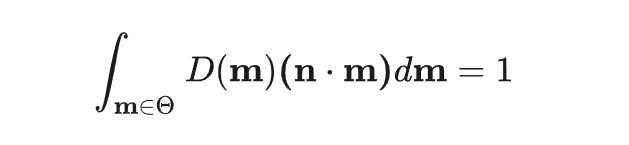

微表面模型所代表的是一种对于表面的建模，在这个模型中，所有宏观表面都被视为是由一个个微小的表面组成的，光与这些宏观表面所产生的互动由这些微表面的性质所影响。

### 法线分布函数

法线分布函数NDF描述的正如其名字，代表着一个在这个宏观片元附近一个法线方向$n$的分布概率。从另一个角度来看，NDF实际上代表着在这个表面的一个宏观面积为1的片元区域：方向朝向为$n$的片元的面积总和。NDF的定义域为方位角空间，输出为球面度的倒数。

我们可以参考这张图示

如图，如果我们对于$D(n)$在方位角上求积分，那么得到的就是所有微表面的面积总和（直观一点说就是红色线段的长度）；如果我们将其投影到水平上，即如果我们求$D(n)(mn)$，那么最终就会得到宏观片元的面积，这个面积在之前我们就提到了，被规定为1。（直观一点说就是函数在x轴上的投影的长度）

### 几何函数

> 一句话总结：对于微表面法线强度的修正项；将入射和出射方向上不可见的比例去除掉。

我们通过法线分布函数以及可以很好地得到在当前这次光线入射出射过程中微表面的法线强度，然而我们仍然需要考虑一点：有一些微表面尽管理论上可以将光线反射到视角方向，但是却因为各种原因被遮挡了。这种遮挡有两种情况：
1. 阴影（Shadowing）表示微表面对于入射光的遮挡。
2. 遮蔽（Masking）表示微表面对于出射光的遮挡。

对于几何函数的数学定义：

我们考虑一个方向的几何函数（即按照两个$G_1$分开考虑的方式），以入射光为例

需要注意的是，实际上上面这个公式很好地体现了G项的含义：一个补偿项。

在没有G项的时候，法线分布函数具有一个相似的积分结果：

两个公式的区别就在于$mn$这一项，G项需要补偿的就是当入射光方向和法线朝向点积为负时的情况，在这个时候我们如果只采用法线分布函数去积分就显然不能保证能量守恒，因此我们在这里加上了一个G项来保证被积出来的结果仍然不变。（那么为什么之后还需要KC近似来补偿多次弹射呢？感觉G项在这里代表的就已经是对于多次弹射的一个近似了）

### 分母

对于最终BRDF的表达，有一个很常见的问题：BRDF的分母的含义是什么？

关于这个问题，[PBRT第四版这篇章节](https://pbr-book.org/4ed/Reflection_Models/Roughness_Using_Microfacet_Theory#TheTorrancendashSparrowModel)给出了很好的解释（尽管并非很严谨）。通俗地总结的话：分母的出现是因为NDF的概率变量和最终用来计算积分的被积变量不一致导致的，分母实际上出现是因为我们进行了Change of Variables。
具体的推导过程可以参考[这里](https://pbr-book.org/4ed/Reflection_Models/Roughness_Using_Microfacet_Theory#eq:reflect-dwm-dwo)和[这里](https://pbr-book.org/4ed/Reflection_Models/Roughness_Using_Microfacet_Theory#x5-TorrancendashSparrowBRDF)

参考：
[【基于物理的渲染（PBR）白皮书】（四）法线分布函数相关总结（毛星云）](https://zhuanlan.zhihu.com/p/69380665)
[【基于物理的渲染（PBR）白皮书】（五）几何函数相关总结（毛星云）](https://zhuanlan.zhihu.com/p/81708753)

[Understanding the Masking-Shadowing Function in Microfacet-Based BRDFs](https://inria.hal.science/hal-00942452v2/document)