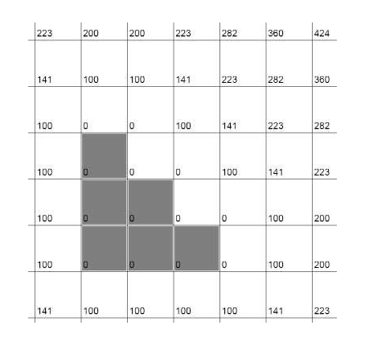

### Motivation

Collision detection is an important module. For a game with multiple movable characters and complex geometry, collision detection will consume more time. In this project, the author proposes a novel SDF-based approach that might be able to reduce redundant collision detection within one frame.

### Basic Structure

First, we assume you have already known what SDF is. We need to generate a coarse SDF for 3D scene. Before every collision detection, we will query the SDF voxel texture. The sampled value is the minimal distance and if the minimal distance is more than a fixed threshold value, it means that current collider is still far away from any other colliders. We will skip collision detection.

The basic structure of this optimization is rather straightforward. The bound of this program, as we have implemented the whole logics, is not the core logic of this optimization, but these three parts
- Storage of SDF
    - Storing a SDF for a scene is not that consuming, but for mobile device, loading SDF on memory can potentially be a trouble. 
- Generate SDF
    - Certainly, we can generate SDF fully offline. But speeding up scene SDF is still neccessary.
- Updating SDF
    - In this project, we have to update SDF as there are multiple dynamic objects in the scene. 

### Store SDF

In this program, I also adopted different SDF storage strategies. 
![sdf_naive]
![sdf_threshold]
![sdf_interval]
![sdf_layered]

[sdf_interval]: https://github.com/SydianAndrewChen/sydianandrewchen.github.io/blob/main/images/sdf_interval.png?raw=true
[sdf_layered]: https://github.com/SydianAndrewChen/sydianandrewchen.github.io/blob/main/images/sdf_layered.png?raw=true
[sdf_threshold]: https://github.com/SydianAndrewChen/sydianandrewchen.github.io/blob/main/images/sdf_threshold.png?raw=true
[sdf_naive]: https://github.com/SydianAndrewChen/sydianandrewchen.github.io/blob/main/images/sdf_naive.png?raw=true

### Generate SDF

- EDT

- 8ssedt

- Saito & Toriwaki

### Update SDF