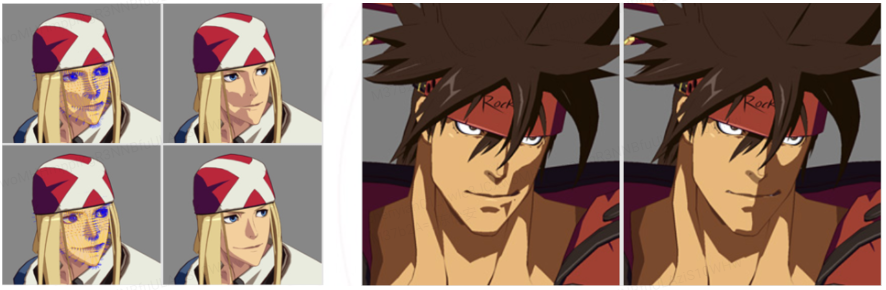
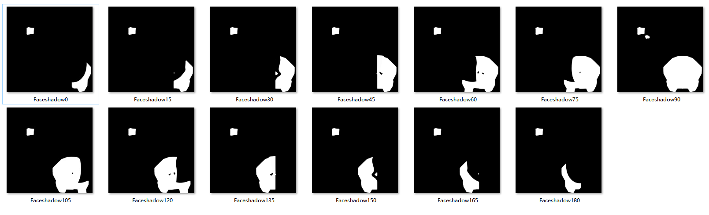
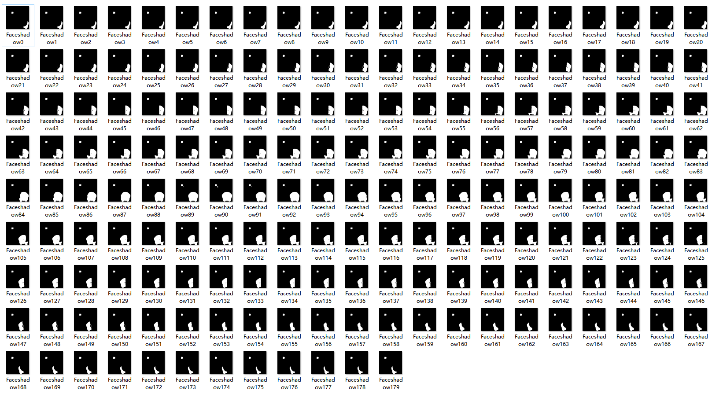
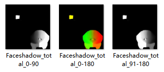
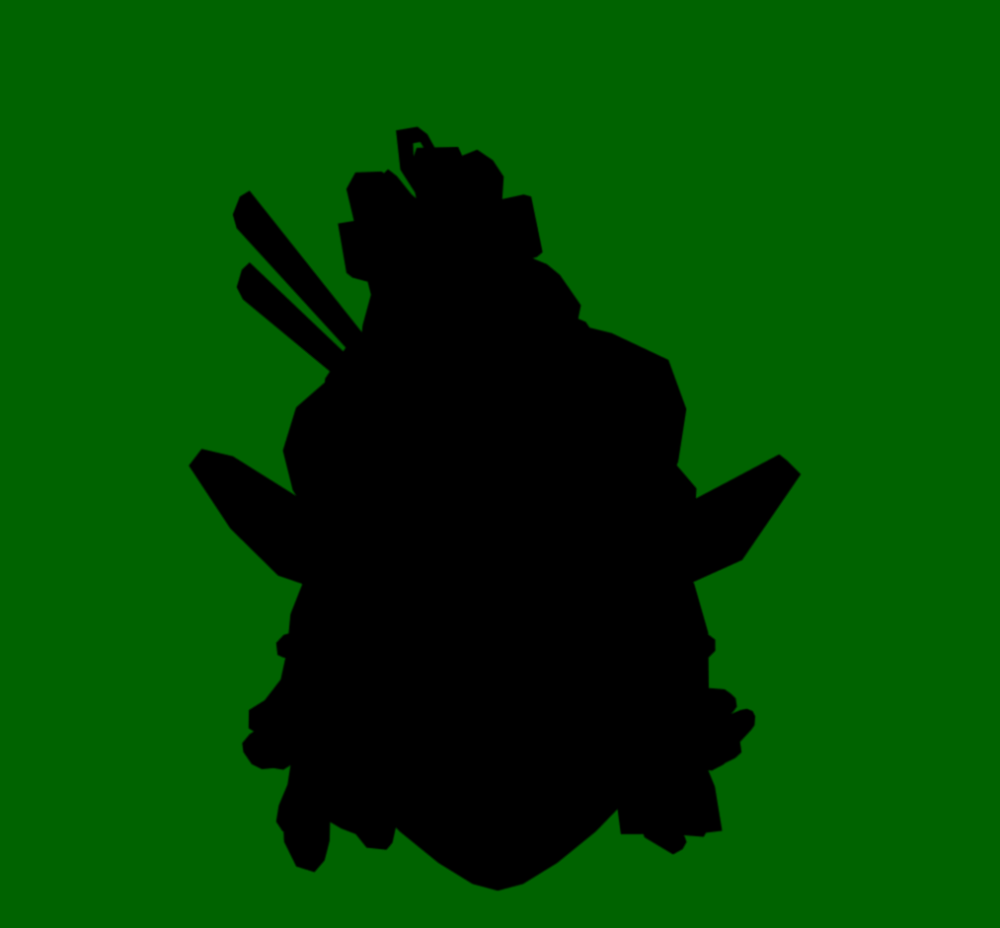

<video width="1080" height="960" controls>
  <source src="https://github.com/SydianAndrewChen/sydianandrewchen.github.io/blob/main/images/ShadowMaskEditor2021-11-17-11-28-26.mp4?raw=true" type="video/mp4">
</video>

### Stylized Shadow

In traditional realtime rendering, there are multiple techniques available to render shadow of great quality.

Common techniques are listed below. Some articles might be written in future about them.

- Shadow mapping
- Cascaded shadow map
- VSF
- SDF shadow map

Most shadowing techniques listed above are used for realistic rendering. In some scenarios, however, we want to achieve a more stylisitc rendering effect.

A great example would be [Guilty Gear Series](https://www.guiltygear.com/ggst/en/). This game series utilizes 3D character models for animation but rendered the models as if they are painted as keyframes in 2D pipelines. The result looks great, and the shadow cannot be achieved by utilizing traditional shadowing algorithms. According to their [technical presentation](https://www.arcsystemworks.com/guilty-gear-xrds-art-style-the-x-factor-between-2d-and-3d-talk-from-gdc-2015-is-now-available-online/) in 2015(A little bit outdated), they developed a inside tools to adjust the normals of models manually, to make sure that the shadow of the models can look natural under light from any aspect. 

This method will generate great looking facial shadow. However, it will take artists great amount of work to adjust normals manually. What is worse, if we need to modify the topology of character mesh, the normals will need to be re-edited fully. 

---

Another great example would be [Genshin Impact](https://genshin.hoyoverse.com/en/). This game does not pursuit the feeling of 2D keyframe as in Guilty Gears, but the shadow still looks great and natural. 

We will demonstrate with more details below.

---

### Thresholded Shadow Texture

We will first generate facial shadow texture under light from different key angles. The proper way of generating such shadow texture varies. Artist can draw the texture themselves, however, this project also provides a way to automatically generate a good-looking facial shadow texture.

Then, we will generate the SDF of facial shadow under different light angles, and slerped the SDFs to generate facial shadow in the light angles of the intervals.

Eventually, we will average the generated shadow textures.

To use this shadow texture, we will calculate `FdotL` and use this as a theshold to sample the shadow texture.

All clear! However, one problem still remains, how can we get the facial texture at key angle at the first place? We can leave this work to artists. However, this project provides a way to automatically generate good-looking facial shadow texture with artists labeling special area of character facial model.

---

### Facial Shadow

The structure of human face is complicated, resulting in a more complicated shadow effect. However, to simulate shadow effect in non-photorealistic rendering, we need to split and only keep the main component to make the graphics clean and tidy.

Observing human face shadows in real life, we can find out that, apart from the natural shadow, there are two parts that we need to consider. The first is the special shadow effect caused by human nose. The second is the small triangle lighted area that is close to nose. We will demonstrate with more details below.

#### Face Normal

To achieve a stylistic clean shadowing, we will use different normal here, instead of the original normal of model to generate a smoother effect. We use spherical coordinate of xz plane here as normal.

#### Nose 

Human nose is the 

#### Rembrandt Lighting

#### Face

#### Add together

### Technical Details

### Tools
