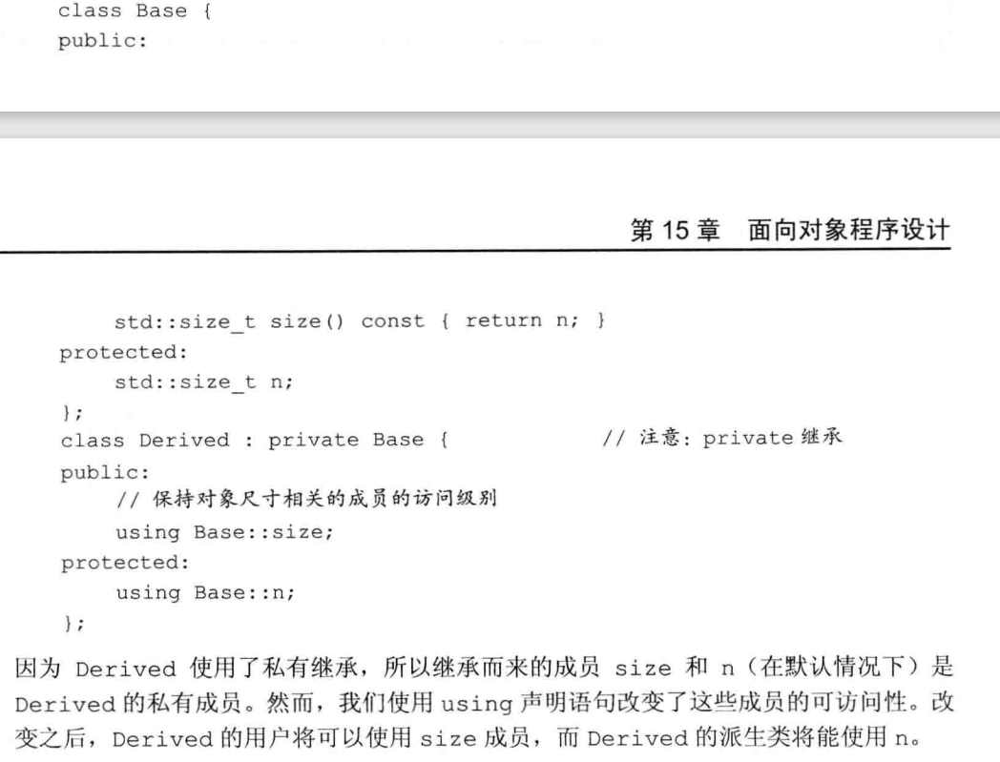

## 继承

在层次关系的根部有一个基类，其他类则直接或间接地从基类继承而来，这些继承得到的类称为派生类。基类负责定义在层次关系中所有类共同拥有的成员，而每个派生类定义各自特有的成员

C++语言中，基类将类型相关的函数与派生类不做改变直接继承的函数区分对待。对于某些函数，基类希望它的派生类各自定义适合自身的版本，此时基类就将这些函数声明成**虚函数**。

派生类必须通过**类派生列表**明确指出它是从哪个基类继承而来的。类派生列表的形式是：首先是一个冒号，后面紧跟以逗号分割的基类列表，其中每个基类前面可以有访问说明符。

```
class Quote;
class Bulk_Quote:public Quote{};
```

派生类必须在其内部对所有重新定义的虚函数进行声明。派生类可以在这样的函数之前加上virtual关键字，但是并不是非得这么做。

C++11新标准允许派生类显式地注明它将使用哪个成员函数改写基类的虚函数，具体措施是在 该函数的形参列表之后加上一个override关键字。

### 成员函数与继承

基类通过在其成员函数的声明语句之前加上virtual使得该函数执行动态绑定。任何构造函数之外的非静态函数都可以是虚函数。

**关键字virtual只能出现在类内部的声明语句之前而不能用于类外部的函数定义。**

**如果基类把一个函数声明成基函数，那么该函数在派生类中隐式地也是虚函数。**

成员函数如果没有被声明成虚函数，那么其解析过程发生在编译时而非运行时。

### 访问控制与继承

派生类可以继承定义在基类中的成员，但是派生类的成员函数不一定有权访问从基类继承而来的成员。和其他使用基类的代码一样，派生类能访问公有成员，而不能访问私有成员。不过某些时候基类中还有这样一种成员，基类希望它的派生类有权访问该成员，同时禁止其他用户访问。我们用protected访问运算符说明这样的成员。


### 定义派生类

派生类必须通过**类派生列表**明确指出它是从哪个基类继承而来。类派生列表的形式是：首先是一个冒号，后面紧跟逗号分隔的基类列表，其中每个基类前面可以有以下三种访问说明符中的一个：public、protected或者private。

派生类**必须**将其继承而来的成员函数中需要覆盖的那些**重新声明**。

访问说明符的作用是控制派生类从基类继承而来的成员是否对派生类用户可见。

如果一个派生是公有的，则基类的公有成员也是派生类接口的组成部分。此外，我们能将公有派生类型的对象绑定到基类的引用或指针上。

**派生类经常（但不总是）覆盖它的虚函数。**如果派生类没有覆盖其基类中的某个虚函数，则该虚函数的行为类似于其他普通成员，派生类会直接继承其在基类中的版本。

派生类可以在它覆盖的函数前使用virtual关键字，但不是非得这么做。C++11标准允许派生类显式地注明它使用某个成员函数覆盖了它继承的虚函数。具体做法是在形参列表后面、或者在const成员函数的const关键字后面、或者在引用成员函数的引用限定符后面添加一个关键字override。


### 派生类对象及派生类向基类的类型转换

一个派生类对象包含多个组成部分：一个含有派生类自己定义的（非静态）成员的子对象，以及一个与该派生类继承的基类对应的子对象，如果有多个基类，那么这样的子对象也有多个。

因为在派生类对象中含有与其基类对象对应的组成部分，所以我们能把派生类的对象当成基类对象来使用，而且我们也能将基类的指针或引用绑定到派生类对象中的基类部分。这种转换通常称为**派生类到基类的**类型转换。和其他类型转换一样，编译器会隐式地执行派生类到基类的转换。

这种隐式特性意味着我们可以把派生类对象或者派生类对象的引用用在需要基类引用的地方；同样的，我们可以把派生类对象的指针用在需要基类指针的地方。


### 派生类构造函数

尽管在派生类对象中含有从基类继承而来的成员，但是派生类并不能直接初始化这些成员。和其他创建了基类对象的代码一样，**派生类也必须使用基类的构造函数来初始化它的基类部分**。

> 每个类控制它自己的成员初始化过程

```
Bulk_Quote(const std::string & book, double p, std::size_t qty, double disc) : 
	Quote(book, p), min_qty(qty), discount(disc){ };
```

除非我们特别指出，否则派生类对象的基类部分会像数据成员一样执行默认初始化。如果想使用其他的基类构造函数，我们需要以类名加圆括号内的实参列表的形式为构造函数提供初始值。

> 首先初始化积累的部分，然后按照声明的顺序依次初始化派生类成员。


### 继承与静态成员

如果基类定义了一个静态成员，则在整个继承体系中只存在该成员的唯一定义。不论从基类中派生出多少个派生类，对于每个静态成员来说都只存在唯一的实例。


### 被用作基类的类

如果我们想将某个类用作基类，则该类必须已经定义而非仅仅声明：

```
class Quote; //声明但未定义
// 错误： Quote类未定义
class Bulk_Quote: public Quote{ ... };
```

这一规定的原因有两层：第一层显而易见，派生类中包含并且可以使用它从积累继承而来的成员，为了使用这些成员，派生类当然要知道它们是什么。该规定还有一层隐含的意思，一个类不能派生它本身。

一个类可以既是派生类又是基类。


### 防止继承的发生

C++11新标准提供了一种方法防止继承发生，即在类名后面跟一个关键字final。


## 类型转换和继承

我们可以将基类的指针或引用绑定到派生类的对象上。

当使用基类的引用（或指针）时，实际上我们并不清楚该引用（或指针）所绑定对象的只是类型。该对象可能是基类的对象，也可能是派生类的对象。

> 和内置指针一样，智能指针类也支持派生类向基类的类型转换，这意味着我们可以将一个派生类对象的指针存储在一个基类的智能指针内。


### 静态类型和动态类型

表达式的静态类型在编译时总是已知的，它是变量声明时的类型或表达式生成的类型；动态类型则是变量或表达式表示的内存中的对象的模型。

如果一个表达式既不是引用也不是指针（也不是智能指针），则它的动态类型永远与静态类型一致。


### 不存在从基类向派生类的隐式转换

RT


### 在对象之间不存在类型转换

派生类向基类的自动类型转换只对指针或者引用类型有效，在派生类类型和基类类型之间不存在这样的转换。很多时候，我们确实希望能将派生类对象转换成它的基类类型，但是这种转换的实际发生过程往往与我们期望的有所差别。

当我们初始化或者赋值一个类类型对象的时候，实际上是在调用某个函数。当执行初始化时，我们调用构造函数；执行赋值操作时，调用赋值运算符。这些成员通常都包含一个参数，类型为类类型的const版本引用。

因为这些成员接受引用为参数，因此派生类向基类的转换允许我们使用基类的拷贝/移动操作传递一个派生类对象。当我们给基类的构造函数传递一个派生类对象时，实际运行的构造函数是基类中定义的那个，**显然该构造函数只能处理基类自己的成员**。类似的，如果我们将一个派生类对象赋值给一个基类对象，则实际运行的赋值运算符也是基类中定义的那个，**该运算符同样只能处理基类自己的成员。**

我们可以说转化后基类的派生类部分被切掉（sliced down）了。


# 虚函数

我们**必须为每一个虚函数都提供定义，而不管它是否被用到了**，这是因为连编译器也无法确定到底会使用哪个虚函数。


### 对虚函数的调用可能在运行时才被解析

当某个虚函数通过指针或引用调用时，编译器产生的代码直到运行时才能确定应该调用哪个版本的函数。被调用的函数是与绑定到指针或引用上的对象的动态类型相匹配的那一个。

当我们通过一个普通类型的表达式调用虚函数时，在编译时就会将调用的版本确定下来。


> ### C++的多态性
>
> OOP 的核心思想是多态性。
>
> 我们把具有继承关系的多个类型称为多态类型，因为我们能使用这些类型的“多种形式”而无需在意它们的差异。引用或指针的静态类型与动态类型不同这一事实正是C++语言支持多态性的根本所在。


### 派生类中的虚函数

当我们在派生类中覆盖了某个虚函数时，可以再一次使用virtual关键字指出该函数的性质。然而这么做并非必须，**因为一旦某个函数被声明称虚函数，则在所有派生类中它都是虚函数。**

一个派生类的函数如果覆盖了某个继承而来的虚函数，则它的**形参类型必须与被它覆盖的基类函数完全一致**。

同时，一般来说，派生类中的虚函数的返回类型也必须与基类函数相匹配。但存在一个例外，当类的虚函数返回类型是类本身的指针或者引用时，该规则无效。比如D如果是从B派生得到，则基类的虚函数可以返回B\*而派生类的对应函数可以返回D\*，只不过这样的返回类型要求从D到B的隐式类型转换是可访问的。


### final和override说明符

派生类如果定义了一个函数与基类中的虚函数的名字相同但是形参列表不同，这仍然是合法的行为。编译器将认为这个新定义的函数与基类中原有的函数是相互独立的。这时，派生类的函数并没有覆盖掉基类中的版本。然而就实际的编程习惯而言，这种声明往往意味着发生了错误，因为我们大概率是希望派生类能够覆盖掉基类中的虚函数的，但是一不小心把形参列表搞错了。

在C++11标准中我们可以使用override关键字来说明派生类中的虚函数。如果我们使用override标记了某个函数，但该函数并没有覆盖已存在的虚函数，此时编译器将报错。

**override必须加在可覆盖的函数之后**，否则也将报错。


我们还能把某个函数定为final，如果我们把函数定位final了，则之后任何尝试覆盖该函数的操作都将引起错误

### 回避虚函数

在某些情况下，我们希望对虚函数的调用不要进行动态绑定，而是强迫其执行虚函数的某个特定版本。使用作用域运算符可以实现这一目的。

```c++
double undisconnected = baseP->Quote::net_price(42);
```

什么时候我们需要回避虚函数的默认机制呢？通常是当一个派生类的虚函数调用它覆盖的基类的虚函数版本时。在此情况下，基类的版本通常完成继承层次中所有类型都要做的共同任务，而派生类中定义的版本需要执行一些与派生类自身密切相关的操作。

> 如果一个派生类虚函数需要调用它的基类版本，但是没有使用作用域运算符，则会导致无限递归。


# 抽象基类

### 纯虚函数

一个纯虚函数无须定义。我们通过在函数体的位置（即在声明语句的分号之前）书写=0就可以将一个虚函数说明为纯虚函数。其中，=0只能出现在类内部的虚函数声明语句处。


含有纯虚函数的类是抽象基类。抽象基类负责定义接口，而后续的其他类可以覆盖该接口。

每个派生类都只初始化它的直接基类。

重构：重构负责重新设计类的体系以便将操作和/或数据从一个类移动到另一个类中。对于面向对象的程序来说，重构是一种很普遍的现象。


# 访问控制与继承

每个类还分别控制着其成员对于派生类来说是否**可访问**。

protected访问说明符的理解：

- 受保护的成员对于用户不可访问。
- 受保护的成员对于派生类的成员和友元来说可访问。
  - 但是派生类的成员或友元只能通过派生类对象来访问基类的受保护成员。派生类对于一个基类对象中的受保护成员没有任何访问特权。
  - 我们可以理解为：派生类中的成员和友元所访问的实际上是在派生类中基类部分的受保护对象。因此可以访问。

### 访问说明符的继承

某个类对其继承而来的成员的访问权限受到两个因素的影响：

- 基类中该成员的访问说明符
- 派生类的派生列表中的访问说明符（派生访问说明符）

访问说明符继承的个人理解：

- 派生访问说明符不会影响在派生类中对于基类成员的访问权限（public、protected可访问，private不可访问照旧）。
- 派生访问说明符的目的是控制派生类用户对于基类的访问权限。
  - 派生访问说明符控制的是派生类中基类部分成员的访问权限；更具体地说，控制的是在基类定义中被public和protected修饰的成员。派生说明符如果是：
    - public，那么原基类中被public和protected修饰的成员，在派生类中访问权限保持不变。private不可访问。
    - protected，那么原基类中被public和protected修饰的成员，在派生类中访问权限变为protected。private不可访问。
    - private，那么原基类中被public和protected修饰的成员，在派生类中访问权限变为private。private不可访问。


### 派生类向基类转换的可访问性

派生类向基类的转换是否可访问由使用该转换的代码决定，同时派生类的派生访问说明符也会有影响。假定D继承自B：

- **只有当D公有地继承时，用户代码才能使用派生类向基类的转换**；如果D继承B的方式是受保护的或者私有的，则用户代码不能使用转换。
- 不论D以什么方式继承B,D的成员函数和友元都能使用派生类向基类的转换；派生类向其直接基类的类型转换永远是可访问的。
- 如果D继承B的方式是公有的或者受保护的，则D的派生类的成员和有缘可以使用D向B的类型转换；反之，如果D继承B的方式是私有的，则不能使用。

对于代码中的某个给定节点来说，如果基类的公有成员是可访问的，则派生类向基类的类型转换也是可访问的；反之则不行。

**友元不能继承。**基类的友元对于派生类无效；反之亦然。


### 可以通过使用using改变个别成员的可访问性




class默认private，struct默认public


### 继承中的类作用域

派生类的成员将隐藏同名的基类成员。我们可以通过作用域运算符来使用隐藏的成员。


## 虚继承


# C++面向对象布局


- 对于单个类对象，不考虑继承的情况下
  - 非静态成员变量：类对象内
  - 静态成员变量：类对象外
  - 非虚成员函数：类对象外
  - 虚成员函数：通过虚函数表加虚指针来支持，虚指针在类对象内。
    - 虚函数表的前一个位置设置了一个指向type_info的指针，用以支持RTTI。
- 在引入继承之后，考虑单继承
  - 如果子类对基类虚函数进行重写，那么在虚表中就会覆盖对应的虚函数指针
  - 如果声明了新的虚函数，就会在当前虚表之后加上一个新的虚函数指针


- 考虑多继承（非菱形继承）
  - 每继承一个（含有虚函数的）类，就在内存上加一个虚指针，指向基类虚表。
  - 如果子类中新声明了一个虚函数，会往继承声明里的第一个父类的虚函数表中扩展。
  - 如果子类中重写了一个虚函数，会对基类中所有重名虚函数对应的虚表指针进行覆盖。

- 考虑多继承（菱形继承）
  - 会出现二义性，因为在对子类实例化的时候可能会实例化出多个间接基类。
    - 当我们想要使用一个间接基类的成员变量的时候，我们必须要指明这个成员变量的作用域。

- 虚继承

  虚继承解决了菱形继承中派生类拥有多个间接父类实例的情况，其内存布局和普通继承有很多不同。

  - 虚继承的子类，如果本身定义了新的虚函数，编译器就会为其生成一个虚函数指针，以及一个虚表，该vptr位于对象内存最前面（在非虚继承中，我们是直接在第一个基类的虚表中进行扩展的）
  - 虚继承的子类同时单独保留了父类的虚指针和虚函数表，这部分内容与子类内容以一个四字节的0
  - 虚继承的子类中，含有四字节的虚表指针偏移值
  - 之后是虚基类表指针。其指向的内存首位为当前虚基类指针离对象内存首位偏移值，第二第三个...条目依次为该类的最左虚继承基类、次左虚继承基类...的内存地址相对于虚基类指针的偏移值
  
- 虚继承（单继承）

  - 如果定义了新的虚函数，那么内存首位会是一个在当前作用域下的虚指针
  - 之后紧跟一个虚基类指针，

- 虚继承（菱形继承）

  - 菱形继承下，一般是子类继承自两个父类，两个父类虚继承自一个祖父类
  - 这种情况下，就是虚继承布局和正常继承布局的一种混合
  - 首先是两个正常继承父类的内存布局，然后是当前子类的成员变量，最后由一个4字节0隔开之后是虚祖父类的内存布局


## 虚函数表

虚函数指针指向虚函数表，虚函数表中存储的是一系列虚函数的地址，虚函数地址出现的顺序与类中虚函数声明顺序一致。对虚函数指针地址值，可以得到虚函数表的地址，也即是虚函数表第一个虚函数的地址


## 对象模型概述

C++中一共有两种成员变量： static和non-static的

三种成员函数：static, non-static以及virtual的