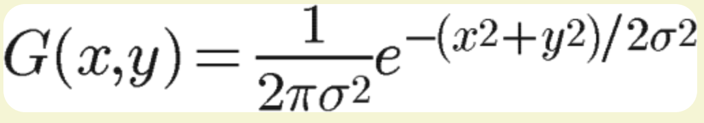

重点复习learn opengl以及GAMES101

# 面试考点

- 高斯模糊

  - 大致思想即：对于每个3x3的像素块的中心，我们都将其值取为其他8个像素的均值，这样可以使得图像的频率降低，使得图片看起来更加平滑，但显然，单纯取平均并不是特别科学

  - 因此我们采取正态分布的密度函数（高斯函数）来进行权重分配，根据正态分布进行的模糊

    二维高斯函数

  - 正常计算的时候，忽视前面的常数项，并假定一个合理的方差（简化计算）

  - 我们生成了一个高斯矩阵之后，就可以利用这个矩阵对整个图像做卷积

# Learn OpenGL

- 从3D坐标到2D坐标的转化：**图形渲染管线**
- 渲染管线分为两个部分：
  - 将3D坐标转化为2D坐标
  - 将2D坐标转化为像素
- 渲染管线
  - 顶点着色器（Vertex Shader）(可定义)
    - 将3D坐标转化为另一种3D坐标
    - 允许我们对顶点属性做一些基本处理
  - 图元/形状装配（Shape Assembly）
    - 将顶点着色器输出的所有顶点作为输入，并将所有的点装配成指定图元的形状（`GL_POINTS`, `GL_TRIANGLE`, `GL_STRIP`）
  - 几何着色器（Geometry Shader）（可定义）
    - 几何着色器将图元形式的一系列顶点的集合作为输入，可以通过产生新顶点构造出新的图元来生成其他形状。
  - 光栅化（Rasterization）
    - 会把图元映射到最终屏幕上对应的像素，生成供片段着色器使用的片段。
    - 在片段着色器运行之前会执行裁切，丢弃掉视图以外的所有像素，用来提升效率。
  - 片段着色器（Fragment Shader）（可定义）
    - 计算一个像素的最终颜色（考虑光照、阴影等等）
  - 测试与混合（Test and Blending）
    - 检测深度和alpha值，并对物体进行混合
- 我们必须至少定义一个顶点着色器和片段着色器（这两个着色器无默认）

## 顶点输入

- OpenGL仅在3D坐标顶点值位于-1到1（标准化设备坐标）的时候才会处理

## 重要API原型解析

- `glVertexAttribPointer`
  - 第一个输入代指输入的attribute的索引，一般来说，每个buffer的数据都由几个vertex组成，每个vertex所存储的是当前vertex的各个attribute，可能包括位置、颜色、法线向量、漫反射系数等等。我们将会为每个attribute规定一个索引，以便之后在shader进行对应attribute数据的获取
  - 第二个和第三个输入的分别是当前需要获取attribute的元素个数和元素数据类型。比如颜色可能是由三个整型变量代指，那么这里的输入就将是3和GL_INT。
  - 第四个参数规定是否对输入参数进行标准化。比如我们可能需要对颜色参数进行从0-255到0-1的标准化。
  - 第五个参数步长和第六个参数offset共同告诉GL以何种方式去处理buffer上的数据。
    - 步长代指每个vertex的byte数
    - offset代指每个vertex上我们需要的attribute所在的起始点
  - 所以调用函数时，函数会计算当前attribute的数据长度，根据步长划分vertex，根据offset和attribute长度找到attribute数据，然后根据attribute元素个数将数据存储到合适的数据结构里，并根据索引记录到合适的地方以供之后的shader读取。
- `glEnableVertexAttribArray`
  - 参数为我们需要enable的attribute的索引（根据之前的规定）

## OpenGL的五个坐标系

- 局部空间 Local Space 又称物体空间 Object Space
  - 指物体所在的坐标空间
- 世界空间 World Space
- 观察空间 View Space 又称视觉空间 Eye Space
- 裁剪空间 Clip Space
- 屏幕空间 Screen Space

## 坐标系的变换

- 局部空间通过Model Matrix变换成世界空间

  - 局部坐标是对象相对于局部原点的坐标
  - 模型矩阵(Model Matrix)的作用是将所有物体相对于世界原点进行摆放（位移旋转缩放）
- 世界空间通过View Matrix变换成观察空间

  - 接下来我们通过视图矩阵将世界坐标变换成观察坐标，使得每个坐标都是从摄像机的角度进行观察的
- 观察空间通过Projection Matrix变换成裁剪空间

  - 坐标被变换到观察空间之后，我们需要将其投影到裁剪空间上，裁剪空间将会是一个-1到1的空间
- 裁剪空间通过Perspective Divide（透视除法）变换成规范化设备坐标系（NDC Space）
- NDC坐标系通过视口变换转换成屏幕坐标系

- 速度过快/体积过小导致物理引擎检测不到碰撞，如何解决
  - 将碰撞体检测改为连续检测
  - 改成射线检测

- 渲染流水线
- 前向渲染和延迟渲染
- 光栅化和光线追踪
- 顶点着色器的用处，过程
- 实现阴影的方式
- PBR（渲染方程）
- Mipmaps
- 光照模型
  - Blinn-Phong和Phong的区别
  - Gerould Shading和Phong Shading的区别
- Gamma校正

- 深度测试

  - 计算深度值：
    $$
    F_{depth} = \frac{z - near}{far - near}
    $$
    [0,1]以外的值会被舍弃，将平截头体内部的点都映射到0,1区间内部。

  - 实际应用中，我们一般不采取上述的等式，而是使用另一个

  $$
  F_{depth} = \frac{\frac{1}{z} - \frac{1}{near}}{\frac{1}{far} - \frac{1}{near}}
  $$

  ​		这是因为深度值实际上是有非线性性质的，近处的物体要比远处的物体对于深度值有着更大的影响。

  - Z-buffer：为屏幕上的每一个像素保留一个深度缓冲，当一个片段对应的像素的深度缓冲
  - Z-fighting：有时画面会出现锯齿，是因为两个物体摆的太近，因为浮点误差导致深度缓冲频繁替换导致

- 模板测试

- 混合

  - OpenGL默认是不知道如何处理alpha值的
  - 实现全透明效果：
    - 对于alpha值进行检查丢弃
  - 实现混合：
    - 需要控制绘制顺序，从远到近绘制，避免出现因为深度缓冲而导致的遮蔽问题
    - 根据物体离照相机的距离进行排序，借助STL内部的map进行排序

- 面剔除：通过判断三角形方向来判断是否是正面以及是否需要渲染

- Gamma校正：通常来说，每个显示设备都有一个属于自己的Gamma值，当Gamma值为1时是较为理想的线性情况，即：屏幕像素亮度和电压大小呈线性关系。对于CRT，Gamma值一般为2.2。因此输出亮度一般为输入电压的2.2次幂。

  - 因此，我们在做Gamma校正的时候相当于是让屏幕更亮了。

- Shadow Mapping

  - 首先将相机摆在光源位置，绘制当前场景深度贴图（即从光源角度判断哪个能被打到，哪个不能）
  - 再转换回原相机坐标之后，将深度贴图进行转换，通过检查当前片元是否在阴影中，来判断是否对当前片元进行着色

