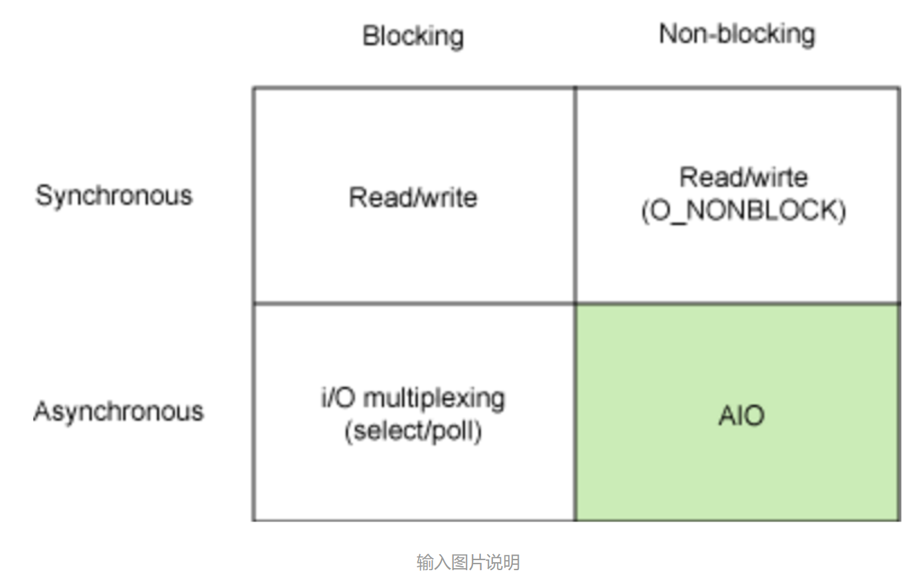
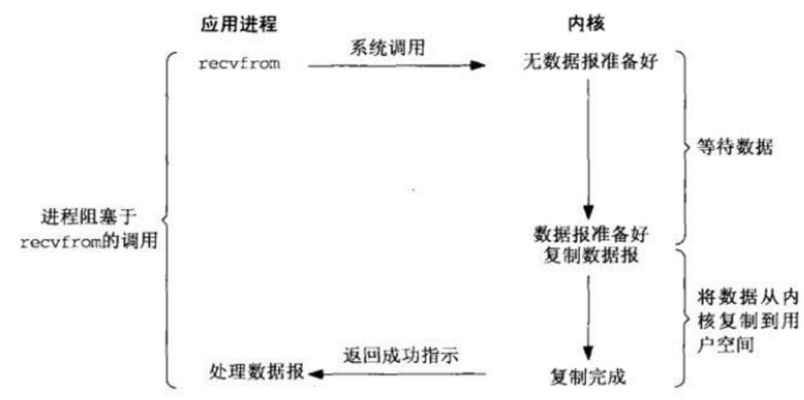
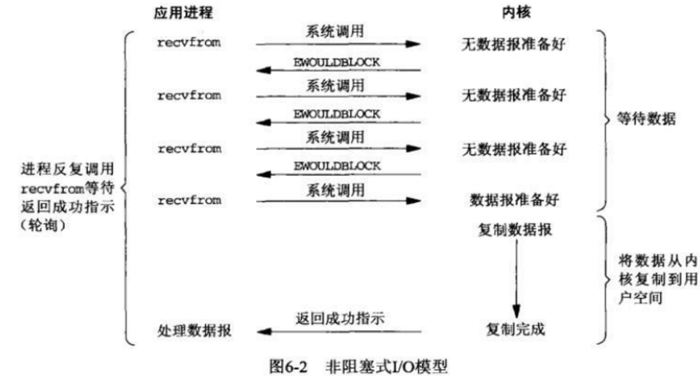

## 操作系统常见面试问题

* [有关Linux进程线程主要知识点](https://www.cnblogs.com/cxuanBlog/p/13277369.html)
* 进程与线程的区别和联系
  
  * 一个线程只能属于一个进程，而一个线程可以有多个线程，且至少有一个线程
  * 资源分配给进程后，同一个线程内的所有线程共享该进程的所有资源
  * 线程是处理机调度的基本单位。而进程则是资源分配的基本单位
  * 线程在执行过程中需要同步，不同进程的线程间需要利用消息通信的方式进行同步
  * 线程更小，因此线程程序的并发性更高
  * 进程拥有独立的地址空间，同一个进程内多个线程共享
  * 每一个线程都有一个程序运行的入口，但线程不能单独执行
* 为什么线程切换更加快速？

  * 进程切换会切换对应的虚拟内存地址空间，因此TLB就失效了。TLB失效之后程序运行就会变慢
* 一个进程可以创建多少线程，和什么有关
  * 一般给一个线程分配的内存为1M，因此我们需要考虑的是不同系统下给特定进程分配的用户内存空间
  * 在32位系统下，4G空间用户可以使用2G，因此理论上最多可以开2048个线程
  * 在64位系统下，用户拥有2^48空间，即512T内存空间，用户理论上最大可以开2^28个线程
* 一个程序从开始运行到结束的完整过程（四个过程）
  * 预处理
    * 主要处理源代码中的预处理指令，引入头文件，去除注释，处理所有的条件编译指令，宏的替换，添加行号，保留所有的编译器指令。
    * 生成.i文件
  * 编译
    * 编译过程进行的是对预处理后的文件进行语法分析、词法分析、语义分析、符号汇总，然后生成汇编代码
    * 生成.s文件
  * 汇编
    * 汇编过程将汇编代码转成二进制文件，二进制文件就可以让机器进行读取，每一句汇编语句都会产生一句机器语言。
    * 生成.o文件
  * 链接
    * 由汇编程序生成的目标文件并不能立即就被执行，其中可能还有很多没有被解决的问题。例如、某个源文件中的函数可能引用了另一个源文件中定义的某个符号；程序中可能调用了某个库文件函数等等。所有这些问题都需要经过连接程序的处理方能得以解决。链接程序的主要工作就是将有关的目标文件彼此相连接，也即将在一个文件中引用的符号同该符号在另外一个文件中的定义连接起来，使得所有的这些目标文件成为一个能够被操作系统装入执行的统一整体。
    * 静态链接：生成.a文件，主要在编译的时候就将库文件里面代码搬迁到可执行的文件中。
    * 动态链接：生成.so文件，主要在执行的时候需要转换到库文件代码执行。
    * 两种链接的优缺点
      1. 静态链接产生的可执行文件体积比较大，而动态链接产生可执行文件体积比较小
      2. 动态链接编译效率高
      3. 静态链接执行效率高
      4. 静态链接可执行文件的“布局”比较好
* 进程通信方法（Linux和windows下）
  * Linux下
    1. 信号

       - 信号时UNIX系统最先开始使用的进程间通信机制。通过向一个或多个进程发送异步事件信号来实现，信号可以从键盘或者访问不存在的位置等地方产生；信号通过shell将任务发送给子进程。

       - 进程可以选择忽略发送过来的信号，但是有两个是不能忽略的：SIGSTOP和SIGKILL。SIGSTOP信号会通知当前正在运行的进程执行关闭操作，SIGKILL信号会通知当前进程应该被杀死。除此之外，进程可以选择它想要处理的信号，可以选择阻止（忽略），也可以选择不阻止，如果不阻止，也可以选择自行处理，或者进行内核处理。如果选择交由内核处理，就将执行默认处理。

       - 在任何非原子指令中，执行都可以中断，如果进程已经注册了信号处理程序，那么就执行该程序，如果没有注册，就将采用默认的处理方式。

       - 信号没有优先级的说法，如果为某个进程产生了两个信号，就将它们呈现给进程或者以任意的顺序进行处理。

    2. 管道

       - 在两个进程之间可以建立一个通道，一个进程向这个通道里写入字节流，另一个进程从这个管道中读取字节流。管道是同步的，当进程尝试从空管道读取数据时，该进程会被阻塞，直到有可用数据为止。shell中的管线pipelines就是用管道实现的，当shell发现输出a|b时，就会创建两个进程，一个是a一个是b，并在这两个应用程序之间建立一个管道使得a进程的标准输出作为b程序的标准输入。a进程产生的输出就不用再写到文件中了。如果管道满了系统就会停止a进程以等待b进程读出数据。

    3. 共享内存

       - 两个进程之间可以通过共享内存来进行进程间通信，其中两个或者多个进程可以访问公共内存空间。两个进程的共享工作是通过共享内存完成的，一个进程所做的修改可以对另一个进程可见。
        - 在使用共享内存前，需要经过一系列的调用流程
              - 创建共享内存段或者使用以创建的共享内存段 `shmget()`(shared memory get)
              - 将进程附加到已经创建的内存段中`shmat()` (shared memory at)
              - 将已连接的共享内存段分离进程 `shmdt` (shared memory detach)
              - 对共享内存段执行控制操作 `shmctl()` (shared memory control)

    4. 先进先出队列（命名管道）

       - 命名管道的工作方式和常规管道非常相似，但是确实有一些明显的区别。
       - 未命名的管道没有备份文件，操作系统负责维护内存中的缓存区，用来将字节从写入器传输到读取器。一旦写入或者输出终止的话，缓冲区将会被回收，传输的数据会丢失。
       - 相比之下，命名管道具有支持文件和独特API。命名管道在文件系统中作为设备的专用文件存在。当所有的进程通信完成之后，命名管道将保留在文件系统中以备后用。命名管道具有严格的FIFO行为。
    5. 消息队列

       - 消息队列是用来描述内核寻址空间内的内部链接列表。可以按几种不同的方式将消息按照顺序发送到队列并从队列中检索消息。每个消息队列由IPC标识符唯一标识。消息队列有两种模式。一种是严格模式，类似于FIFO队列，消息顺序发送，顺序读取。还有一种模式是非严格模式，消息的顺序性不是非常重要。

    6. 套接字

       - socket提供端到端的双向通信。一个套接字可以与一个或多个进程关联。就像管道有命名和非命名一样，套接字也有两种模式，套接字一般用于两个进程之间的网络通信。网络套接字需要来自诸如TCP或者较低级别UDP等基础协议的支持。
        - 套接字有以下几种分类：
            - 顺序包套接字
            - 数据报套接字
            - 流式套接字
            - 原始套接字
  * Windows下
    1. 管道
    2. 信息队列
    3. 共享内存
    4. 信号量
    5. 套接字
* 线程通信方法（Linux和windows下）
  * Linux下
    1. 互斥量
    2. 信号量
    3. 条件变量
  * Windows
    1. 互斥量
    2. 信号量
    3. 临界区
    4. 事件
* 进程通信详解
  * 管道
    * 管道传输数据时单向的，平时Linux内部用的|是匿名管道，用完了就会销毁。
    * 还有另一个类型叫做命名管道，也被叫做FIFO，因为命名管道的数据是先进先出的传输方式
    * 需要通过makefifo命名来创建，并且指定管道名字：
      * `mkfifo ${PIPENAME}`
      * 我们通过`>`往管道中写数据，但是同时需要另一个进程使用`<`将管道中的数据读出才行。
    * 管道的本质是内核里面的一串缓存。从管道一端写入的数据实际上是缓存在内核中的。另一端读取也就是从内核中读取这段数据。
  * 消息队列
    * 管道的通信方式效率较低，不适合进程间频繁地交换数据
    * 因此我们采用消息队列的方式。消息队列是保存在内核中的消息链表。在发送数据时，会以消息体为单位进行发送。
    * 每个消息体都是固定大小的存储块，不像管道是无格式的字节流。
    * 消息队列的生命周期随内核，不像匿名管道的生命周期随进程。
    * 消息队列同样有缺点
      * 通信不及时（需要排队）
      * 附件有大小限制（存储块），不适合大数据的传输
      * 通信过程中，存在用户态和内核态之间的数据拷贝开销
  * 共享内存
    * 拿出一块虚拟地址空间，映射到相同的物理内存中去。
    * 提高了进程间通信的速度
    * 为了保证共享内存同步，需要使用 信号量
      * 
  * 信号
    * 异常情况下进程通信
    * 是进程通信机制中唯一的异步通信机制
  * Socket
    * 跨网络与不同主机上进程之间的通信

1. 文件读写使用的系统调用

2. 怎么回收线程

   - 首先说明线程中要回收哪些资源
     - 子线程创建时从父线程copy出来的栈内存
       - 线程退出有多种方式`return/pthread_exit/pthread_cancel`等等；线程分为可结合的（joinable）和分离的（detached）两种，如果没有再创建线程时设置线程属性为PTHREAD_CREATE_DETAHCED，则线程默认是可结合的。可结合的线程在线程退出后不会立即释放资源，必须要调用pthread_join来显式的结束线程。分离的线程在线程退出时系统会自动回收资源
       - 因此对于这类资源，主要通过**设置分离属性**和**`pthread_join`**两种方法来处理
       - 其中 **设置分离属性** 又可以分别通过 **`pthread_attr_setdetachstat()/pthread_detach()`**来处理
       - 可结合进程的几种退出方式
         - 子线程采用return，主线程使用pthread_join回收线程
         - 子线程采用pthread_exit，主线程采用pthread_join接受pthread_exit的返回值，并回收线程
         - 主线程中调用pthread_cancel并调用pthread_join回收线程
           - 在子线程中被pthread_cancel执行的必要条件：系统调用(sleep, read, write, open等)或设置取消点(pthread_testcancel())
     - 子线程内部单独申请的**堆内存**(malloc, realloc, calloc)和锁资源mutex
       - 一旦处于挂起状态的取消请求，线程草草结束的话，就会导致共享变量以及pthreads对象（例如互斥量）置于一种不一致状态，可能导致进程中其他线程产生错误结果、死锁、甚至造成程序崩溃。
       - 为避免这一问题：使用清理函数`pthread_cleanup_push()/pthread_cleanup_pop()`来处理
   - 总结起来就是有两种方式：分离（该线程结束时自动释放）/结合（阻塞等待，该线程结束时由某个线程手动释放）

3. 守护进程、僵尸进程和孤儿进程

   - 孤儿进程
     - 一个父进程退出，而它的一个或者多个子进程还在运行，那么那些进程将成为孤儿进程。孤儿进程将被init进程（进程号为1）所收养，并由init进程对它们完成状态收集工作
     - 由于孤儿进程会被init进程给收养，因此孤儿进程不会对系统造成危害
   - 僵尸进程
     - 如果父进程没有结束，而子进程终止了，那么在父进程调用wait函数回收这个子进程或者这个父进程终止以前，这个子进程将一直是僵尸进程。
     - 一个进程使用fork创建子进程，如果子进程退出，而父进程并没有调用wait或waitpid获取子进程的状态信息，那么子进程的进程描述符仍然保存在系统中。这种进程被成为僵尸进程
     - 有关进程描述符：进程不仅仅是运行着的程序，还包括拥有的系统资源、当前CPU现场、调度信息、进程间关系等等重要信息，记录这些现场信息的结构就是进程描述符`task_struct`。每个进程都有一个进程描述符，记录着：进程标识符、进程当前状态、栈地址空间、内存地址空间、文件系统、打开的文件、信号量等等。[具体内容可以点击查看](https://blog.csdn.net/luomoweilan/article/details/21196093)
     - Unix提供了一种机制，保证父进程即使在子进程被终止之后还是可以调用子进程结束时的状态信息。即保留进程描述符。直到父进程进行`wait/waitpid`时才释放。但如果父进程一直不进行该调用的话，那么保留的进程描述符就一直不会被释放，其进程号就会一直被占用，然而系统能够使用的进程号是有限的，如果大量产生僵尸进程，将会因为没有可用进程号而导致系统无法产生新的进程，这就是僵尸进程的危害。
     - 任何一个子进程在exit()后，并非马上就消失，而是留下一个被称为僵尸进程的数据结构，等待父进程处理，这是每个子进程在结束时都要经历的阶段。如果子进程在exit()之后，父进程没来得及处理，这时**用ps命令看到的子进程状态就是Z**。
     - 如果一个进程只fork但不wait/waitpid的话，就会产生很多的僵尸进程，如果要消灭系统中的僵尸进程，需要将其父进程杀死，此时所有的僵尸进程就会变成孤儿进程，从而被init进程所收养，这样init就会释放所有的僵尸进程所占有的资源，从而结束僵尸进程。
   - 守护进程
     - 守护进程是运行在后台的一种特殊进程，独立于控制终端并且周期性地执行某种任务或是等待处理某些发生的事件。它不需要用户输入就能运行而且提供某种服务，不是对整个系统就是对某个用户程序提供服务。Linux系统的大多数服务器就是通过守护进程实现的。常见的守护进程包括系统日志进程syslogd、web服务器httpd、邮件服务器senmail和数据库服务器mysqld等。
     - 守护进程一般在系统启动时开始运行，除非强行终止，否则直到系统关机都保持运行。守护进程经常以超级用户权限(root)运行，因为它们需要使用特殊的端口（1-1024）或访问某些特殊的资源。
     - 一个守护进程的父进程是init进程，因为它真正的父进程在fork出子进程后就先于子进程exit退出了，所以它是一个由init收养的孤儿进程。守护进程是非交互式程序，没有控制终端，所以任何输出，无论是向标准输出设备stdout还是标准出错设备stderr的输出都需要特殊处理。
     - 守护进程的名称通常以d(daemon)结尾，比如sshd、xinetd、crond等

4. [处理僵尸进程的两种经典方法](https://www.cnblogs.com/scut-fm/archive/2013/10/29/3393686.html) 

   - 方法一：父进程回收

     - wait 阻塞等待
     - waitpid则提供了更为详尽的功能（增加了非阻塞功能以及指定等待功能）

   - 方法二：init进程回收

     - 方法一往往需要父进程等待子进程完成之后再去回收，在很多情况下这并不合适，因为父进程也许还有其他任务要做，不能阻塞在这里。

     - 方法二的两个前提：

       a. 如果父进程先于子进程结束，那么子进程将会自动被init进程收养

       b. init进程在其子进程结束时，会自动回收其子进程的资源而不是让其成为僵尸进程。

5. **进程终止的几种方式**（？五种还是七种？）

   - 正常退出（三种）

     - 从main函数退出
     - 调用exit-C库函数
     - 调用_exit系统调用

   - exit和_exit的区别

     - \_exit: 进程运行 -> 调用_exit -> 进入内核态 ->进程终止运行

     - exit: 进程运行 -> 调用exit -> 调用终止处理程序 -> 清除I/O缓冲 -> 进入内核态 -> 进程终止运行

     - 区别1：是否清空缓冲区

       ```c++
       int main(void){
       	printf("hello, itcast");
       	// exit(0); // 不需要手动刷新缓冲区
       	fflush(stdout);
       	_exit(0);
       }
       ```

     - 区别2：exit会调用终止处理程序
       
       - atexit可以注册终止处理程序，ANSIC规定最多可以注册32个终止处理程序

   - return 和 exit 的区别

     - exit用于结束正在运行的整个程序，它将参数返回给OS，把控制权交给操作系统；而return是退出当前函数，返回函数值，把控制权交给调用函数。
     - exit是系统调用级别，它表示一个进程的结束；而return是语言级别的，它表示调用堆栈的返回。
     - 在main函数结束时，会隐式地调用exit函数，所以一般程序执行到main()结尾时，则结束主进程。exit将删除进程使用的内存空间，同时把错误信息返回给父进程。
     - 

   - 异常退出（两种）

     - 调用abort产生的SIGABORT信号
     - 由信号终止 Ctrl + C/ SIGINT

6. linux中异常和中断的区别（继续探讨如何进行异常处理和中断处理）

   - 中断：敲击键盘时会产生中断；硬盘读写的时候也会产生中断，所以我们需要知道的是，中断是由硬件设备产生的，而它们从物理上说就是电信号，它们通过中断控制器发送给CPU，接着CPU判断收到的中断来自于哪个硬件设备（这定义在内核中），最后，由CPU发送给内核，由内核处理中断。
   - 异常：我们在学习计算机组成原理时会知道两个概念：缺页异常和除0异常。异常是由CPU产生的，同时会被发送给内核，要求内核处理这些异常。
   - 异同：
     - 相同点：
       - 都是由CPU发送给内核，由内核去处理
       - 处理程序的流程设计上是相似的
     - 不同点
       - 产生源不同
       - 处理程序不同
       - 中断不是时钟同步的，因此中断随时都有可能到来；异常由于是CPU产生的，所以它是时钟同步的。
       - 当处理中断时，处于中断上下文中；处理异常时，处于进程上下文中。

7. 一般情况下在Linux/windows平台下栈空间的大小

8. 五种IO模型

   - 同步：消息通知机制（是主动查询状态还是由该例程完成后返回通知）
   - 阻塞：等待信息完成前是否进行其他操作

   - 
   - 同步IO：阻塞/非阻塞
     - 同步阻塞：在这个IO模型中，用户空间的应用程序执行一个系统调用，这会导致应用程序阻塞，什么也不干，直到数据准备好，并且将数据从内核复制到用户进程，最后进程处理数据。在等待数据到处理数据的两个阶段，整个进程都被阻塞，不能处理别的网络IO。发起调用的应用程序处于一种不再消费CPU而只是简单等待响应的状态。因此从处理角度来看，这是非常有效的。
       - 优点：a. 能够及时返回数据 b. 省事方便
       - 缺点：性能
       - 
     - 同步非阻塞：同步非阻塞就是”每隔一段时间进行一次查询“的轮询（polling）方式。在这种模型中，设备是以非阻塞的形式打开的。这意味着IO操作不会立即完成，read操作可能会返回一个错误代码，说明这个命令**不能立即满足**。也就是说进程进行系统调用之后，没有被阻塞，内核会马上返回进程，如果数据还没准备好，此时会返回一个error。进程在返回后可以干点别的，然后再次发起系统调用。重复上述过程，循环往复地进行recvfrom系统调用。这个过程通常被称之为轮询。轮询检查内核数据，直到数据准备好，再拷贝数据到进程，进行数据处理。需要注意的是，拷贝数据的整个过程中，进程仍然是处于被阻塞的状态。
       - 优点：能够在等待任务期间处理其他操作
       - 缺点：任务完成的响应延迟变大了，因为每过一段时间才去轮询一次read操作，而任务可能在两次轮询之间的任意时间完成。这会导致整体数据吞吐量的降低。
     - IO多路复用通过设置select/epoll/poll来进行各个套接字的监听
   
9. 守护进程

10. 程序从堆中动态分配内存时，虚拟内存上怎么操作的

    - 首先通过虚拟内存查找分配的内存地址，判断分配地址是否有效，再通过页表查询对应的物理内存地址是否空余，如果不空余就产生一个页错误，并采用OS内部的页交换算法进行交换。交换完成之后更新当前进程页表，并继续进行当前进程。

11. 交换空间与虚拟内存的关系

    - 交换空间对应着虚拟内存中的用来临时储存物理内存内容的磁盘空间。当系统的物理内存不够时，我们才使用交换空间。
    - 以Linux操作系统为例，内核将使用页的方式来管理物理内存，内核维持了一张表来记录每一页存储再物理内存还是被交换到交换空间，通过LRU的机制将很长时间没有被使用的页写入到交换空间，这个进程被称作swapping out，当需要访问交换到交换空间中的部分时，通过缺页异常的方式将相应的部分调入物理内存。

12. 堆和栈的区别；从堆和栈上建立对象哪个快？（考察堆和栈的分配效率比较）

    - 栈对象的优势是在适当的时候自动生成，又在适当的时候自动销毁，不需要程序员担心。而堆对象需要调用new操作，new操作会采用某种内存空间搜索算法，而该搜索过程可能是比较费时间的，产生栈对象则没有这么麻烦，只需要移动栈指针就可以了。但是需要注意的是，通常栈空间容量比较小，一般是1MB~2MB，所以体积较大的对象不适合在栈中分配。特别注意递归函数中最好不要使用栈对象，因为随着递归调用深度的增加，所需要的栈空间也会线性增加，当所需栈空间不够时，便会导致栈溢出，这样就会产生运行时错误。
    - 栈是由机器系统提供的数据结构，计算器会在底层对栈提供支持；分配专门的寄存器存放栈的地址，压栈出栈都有专门的指令执行，这就决定了栈的效率比较高。堆则是C/C++函数库提供的，它的机制是很复杂的，例如为了分配一块内存，库函数会按照一定的算法在堆内存中搜索可用的足够大小的空间，如果没有足够大小的空间（可能是由于碎片太多），就有可能调用系统功能去增加程序数据段的内存空间（defragmentation），这样就有可能分配到足够大小的内存，然后再进行返回。显然，堆的效率比栈要低得多。

13. 内存泄漏和内存溢出

    - 内存溢出指的是程序运行过程中申请的内存大于系统能够提供的内存，导致无法申请到足够的内存，就发生了内存溢出
    - 内存泄漏指的是程序运行过程中分配内存给临时变量，用完之后却没有被及时回收，始终占用着内存，既不能被使用也不能被分配给其他程序，于是就发生了内存泄漏
      - 简单理解就是new完不delete
      - 内存泄漏可分为如下四类
        1. 常发性内存泄漏
           - 引起内存泄露的代码会被执行很多次，每次执行都会导致内存泄漏
        2. 偶发性内存泄漏
           - 在某些特定的环境下执行引起内存泄露的代码，才会引起内存泄漏
        3. 一次性内存泄漏
           - 代码只会执行一次，但总有一块内存发生泄漏，多见于构造类时，析构函数没有释放内存
        4. 隐式泄漏
           - 程序运行过程中不断地分配内存，直到结束时才释放内存，但一般服务器程序会运行较长时间，不及时释放也会导致内存耗尽以至于内存泄漏

14. 常见内存分配方式和错误

    - 常见内存方式三种：

      - 从静态存储区分配。内存在程序编译的时候就已经分配好，这块内存在程序的整个运行期都存在。例如全局变量，static变量
      - 从栈上创建。在执行函数的时候，函数内局部变量的存储单元都可以在栈上创建，函数执行结束时这些存储单元自动被释放。占内存分配运算内置于处理器的指令集中，效率很高，但是分配的内存容量有限。
      - 从堆上分配，亦称动态内存分配。程序在运行的时候用malloc或new申请任意多少的内存， 程序员自己负责在合适用free或delete释放内存。动态内存的生存期由我们决定，使用非常灵活，但问题也最多。

    - 常见的内存错误及其对策

      - 内存未分配成功，却使用了它

        在使用内存之前检查指针是否为NULL，如果指针p是函数的参数，那么在函数的入口处用assert(p != NULL)进行检查。如果使用malloc或者new来申请内存，应该用if语句判断p!=NULL进行防错处理。

      - 内存分配虽然成功，但是尚未初始化就引用它。（指我们在创建一个变量的时候虽然成功分配了内存，但未进行初始化就引用这个变量会导致的问题）

        内存的缺省初值到底是什么并没有统一的标准，尽管有的时候为零值，但我们为了保险，尽量无论用何种方式创建数组，都别忘了赋初值，即便是赋零值也不可省略，不要嫌麻烦。

      - 内存分配成功并且已经初始化，但操作越界。

        例如数组经常出现下标多1/少1的情况

      - 忘记了释放内存，导致内存泄漏

        含有这种错误的函数每被调用一次就会丢失一块内存。刚开始时系统的内存充足。但最终有一次程序会突然死掉，系统提示内存耗尽。

        动态内存的申请与释放必须配对，程序中malloc与free（new与delete）的使用次数一定要相同，否则肯定有错误。

      - 释放了内存却继续使用它

        有三种情况

        1. 程序中的对象调用关系过于复杂，实在难以搞清楚某个对象究竟是否已经释放了内存，此时应该重新设计数据结构，从根本上解决对象管理的混乱局面
        2. 函数的return语句写错了，注意不要返回指向“栈内存”的“指针”或者“引用”，因为该内存在函数体结束时会被自动销毁
        3. 使用free或者delete释放内存之后，没有将指针设置为NULL，导致产生了“野指针”

15. 堆内存和栈内存的区别

16. **[可重入函数和可重入内核](https://blog.csdn.net/chj1234chj/article/details/78162443?locationNum=7&fps=1)** 

17. 操作系统动态内存分配的几种策略

    - First-Fit

      需要装入内存时，存储分配程序从最小地址开始扫描，直到找到满足要求的空闲区为止

    - Circular First-Fit

      从上一个停止的地方开始扫描

    - Best-Fit

      按空闲区从小到大进行索引排序，之后从空闲区里找到最小的满足条件的空闲区进行分配

    - Worst-Fit

      空闲区按照大小从大到小进行排序，自表头开始查找到第一个满足要求的空闲分区进行分配

18. 内部碎片和外部碎片

    - 内部碎片指已经被分配出去但不能被利用的碎片。

      内部碎片是出于区域内部的存储块中的。占有这些区域或者页面的进程并不会使用这个存储块。而系统更不会使用这些已经被进程占有的存储块。直到进程释放它，或者进程结束之后，系统才有可能利用这个存储块。

    - 外部碎片

      外部碎片指的是还没有被分配出去，但由于太小了无法分配给申请内存空间的新进程的内存空闲区域。

      外部碎片是处于任何两个已分配区域或页面之间的空闲存储块。这些存储块的总和可以满足当前申请的长度要求，但是由于它们的地址不连续或者其他原因，使得系统无法满足当前申请。

      

19. **内存分配的策略**

20. 系统调用进入内核态的过程

    - 

21. 内核态和用户态的区别

22. 常见的进程调度算法以及linux的进程调度

    - 衡量指标

      CPU利用率（CPU保持繁忙时间比率）

      吞吐量（单位时间完成进程数量）

      周转时间（从进程创建到进程结束时间）

      等待时间（进程在就绪队列等待万飞时间总和）

      响应时间（从时间产生到进程或系统做出响应所经过的时间）

      - 面向用户的准则：
        - 周转时间短
        - 响应时间快
        - 截止时间的保证
        - 优先权原则
      - 面向系统的准则：
        - 系统吞吐量高
        - 处理机利用率好
        - 各类资源的平衡利用

    - FCFS（先到先得算法）

      只考虑进程进入就绪队列的先后，不考虑进程下一个CPU周期的长短以及其他因素

      FCFS是一种非抢占式的调度算法，一旦一个进程占有了处理机，它就一直运行下去，直到该进程完成工作或者因为等待某事件发生而不能继续运行时才释放处理机。

      - 系统只需要有按照FIFO规则建立的后备作业队列/就绪进程队列即可，即一个作业控制块（JCB）或者进程控制块（PCB）加入队列时加在相应队列末尾
      - 调度退出队列时从相应队列首开始顺序扫描，将相关的JCB或PCB移出

      优点：有利于长作业以及CPU繁忙的作业

      缺点：不利于短作业以及IO繁忙的作业

    - 短进程优先调度算法（SJF, shortest job first）

      优点：比FCFS改善平均周转时间和平均带权周转时间，缩短作业的等待时间；提高系统的吞吐量

    - 轮转法（RR, Round Robin）

      让每个进程在就绪队列中的等待时间与享受服务的时间成正比

    - 多级反馈队列算法

      设置多个就绪队列，分别赋予不同的优先级，如逐级降低，队列1的优先级最高。每个队列执行时间片长度也不相同。规定优先级越低则时间片越长，如逐级加倍。

      新进程进入内存之后，先投入队列1某位，按FCFS算法调度；若按队列1一个时间片未能执行完，则降低投入到队列2的某位，同样按FCFS算法调度；如此下去，降低到最后的队列，则按“时间片轮转”算法调度直到完成。

      优点：提高系统吞吐量和缩短平均周转时间而照顾短进程；为了获得更好的I/O设备利用率和缩短响应时间而照顾I/O型进程；不必估计进程的执行时间，动态调节。

    

23. 中断、陷阱、故障和终止

24. 进程通信方法

> 同步进程通信：管道、FIFO（命名管道）、消息队列、共享内存、信号量（用于进程同步）、socket套接字
>
> 异步进程通信：信号

24. 线程互斥和同步的方法

    ## 互斥

    基础概念：

    - 当多线程相互竞争操作共享变量时，如果在执行过程中发生了上下文切换，就会得到错误的结果。事实上，每次运行都可能得到不同的结果，因此输出的结果存在不确定性。
    - 由于多线程执行操作共享变量的这段代码可能导致竞争状态，因此将这段代码称为临界区（critical section），一定不能给多线程同时执行。
    - 我们希望这段代码是互斥的，也就是说保证一个线程在临界区执行时，其他线程应该被阻止进入临界区。

    加锁的目的：保证共享资源在任意时间里，都只有一个线程访问，这样就可以避免多线程导致共享数据错乱的问题。

    当已经有一个线程加锁之后，其他线程加锁就会失败，互斥锁和自旋锁对于加锁失败之后的处理方式是不一样的：

    - 互斥锁加锁失败之后，线程会释放CPU，给其他线程（阻塞）

    - 自旋锁加锁失败之后，线程会忙等待，直到它拿到锁

    ---

    ### 互斥锁

    **互斥锁**加锁失败而阻塞的现象，是由操作系统内核实现的。当加锁失败时，内核会将线程置为【睡眠】状态，等到锁被释放之后，内核会在合适的时机唤醒线程，当这个线程成功获取到锁之后，就可以继续执行。

    因此互斥锁加锁失败之后，需要从用户态陷入到内核态，让内核帮助我们切换线程，虽然简化了使用锁的难度，但是存在一定的性能开销成本。即：两次线程上下文切换的成本。

    当两个线程时属于同一个进程的时候，因为共享虚拟内存，所以在切换的时候，虚拟内存这些资源就保持不动，只需要切换线程的私有数据、寄存器等不共享的数据。然而**线程切换时往往需要的时间比你锁住的代码执行时间还要长**。

    所以，如果**你能确定被锁住的代码执行时间很短，就不应该使用互斥锁，而应该选用自旋锁**。

    ---

    ### 自旋锁

    **自旋锁**是通过CPU提供的CAS函数（Compare And Swap），在用户态就可以完成加锁和解锁操作，不会主动产生线程上下文切换，所以相比互斥锁来说，会快一些，开销也小一些。

    >  compare and swap函数，来自Operating System Concepts

    ```c
    int compare_and_swap(int * value, int expected, int new_value){
    	int temp = * value; // 标记当前锁状态
    	if (*value == expected) // 如果锁是空闲的
    		*value = new_value; // 就将锁修改为当前线程所有
    	
    	return temp; // 返回锁的状态，判断是否解锁
    }
    
    // 一个对于自旋锁的模拟（注意仅仅是模拟！）
    do {
        while (compare_and_swap(&lock, 0, 1) != 0)
            ; /* Do nothing */
        /* Critical section */
        lock = 0; // Release the lock
        /* Remainder section */
    } while (true);
    ```

    一般加锁的步骤：

    1. 查看锁的状态，如果锁空闲，就执行第二步
    2. 将锁设置为当前线程持有

    CAS函数将这两个步骤合成为一个**硬件级原子指令**。

    使用自旋锁的时候，实现忙等待最好是使用CPU提供的PAUSE指令来实现，可以减少循环等待时的耗电量。

    需要注意，在单核CPU上使用自旋锁需要一个抢占式的调度器。否则自旋锁在单CPU上无法使用，因为一个自旋的线程永远不会放弃CPU，导致之后的线程也无法正常工作。

    自旋锁开销少，但如果锁住的代码比较长，那么自旋的线程也会长时间占用CPU资源。

    ---

    这两种锁是最基本的处理方式，使用层面比较相似，但实现上则完全不同：互斥锁采用【线程切换】来应对，自旋锁则采用【忙等待】来应对。

    更高级的锁会选择其中一个进行实现，比如读写锁既可以选择互斥锁实现，也可以基于自旋锁实现。

    ---

    ### 读写锁

    读写锁由读锁和写锁构成。如果只读取共享资源，用【读锁】加锁，如果需要修改共享资源，则用【写锁】加锁。

    工作原理

    - 当【写锁】没有被线程持有的时候，多个线程能够并发地持有读锁，大大提高了共享资源的访问效率，因为【读锁】是用于读取共享资源的场景，所以多个线程同时持有读锁也不会破坏共享资源的数据。
    - 但是，一旦【写锁】被线程持有之后，所有读线程获取【读锁】的操作会被阻塞，而且其他写线程获取【写锁】的操作也会被阻塞。

    所以说，写锁是独占锁，类似互斥锁和自旋锁；而读锁是共享锁，可以同时被多个线程持有。

    读写锁在读多写少的场景，能够发挥优势。

    同时，读写锁根据实现的不同又可以分为【读优先锁】和【写优先锁】。

    【读优先锁】：在锁被释放时，读线程优先获得锁。

    【写优先锁】：在锁被释放时，写线程优先获得锁。

    ---

    

    

    ### 信号量

    信号量通常表示资源的数量，对应的变量是一个整型变量。

    另外，有两个原子操作的系统调用函数是用来控制信号量的，分别是：

    - P操作：将sem减1，相减后，如果 sem < 0，则进程/线程进入阻塞等待，否则继续；因此P操作可能会阻塞。
    - V操作：将sem加1，相加后，如果sem <= 0，则唤醒一个等待中的进程/线程；V操作不会阻塞。

    > Note that in this implementation, semaphore values may be negative, whereas semaphore values are never negative under the classical definition of semaphores with busy waiting. **If a semaphore value is negative, its magnitude is the number of processes waiting on that semaphores.**

    

    ## 同步

    同步，就是并发进线程在一些关键点上可能需要互相等待与互通消息，这种相互制约的等待与互通消息称为进线程同步。

    

    ### 条件变量

    条件变量的引入是为了避免查看条件是否成立而不断轮询的情况，这样也提高了效率；另一个目的是为了防止竞争，条件变量用来阻塞一个线程，当条件不满足时，线程会解开互斥锁并等待（而不是占用着锁等待）条件变化，一旦有某个线程改变了条件变量，它会通知条件变量下的一个或者多个正在被该条件变量阻塞的线程，这些线程会重新上锁并检测条件是否成立。

    条件变量的作用是描述当前资源的状态，即当前资源是否就绪；条件变量是在多线程程序中用来实现“等待->唤醒”逻辑的常用方法。

    条件变量的接口函数：

    ```C++
    //初始化
    // 利用宏进行初始化
    pthread_cond_t cond = PTHREAD_COND_INITIALIZER;
    // 初始化函数
    int pthread_cond_init(pthread_cond_t * restrict cond,
    						const pthread_condattr_t * restrict attr); 
    
    // 销毁
    int pthread_cond_destroy(pthread_cond_t * cond);
    
    // 等待
    int pthread_cond_wait(pthread_cond_t * restrict cond, pthread_mutex_t * restrict mutex);
    /* 该函数用来在一个condition variable 上阻塞等待，包括以下散步操作：释放mutex；阻塞等待；当被唤醒时，重新获得mutex并返回。 */
    
    int pthread_cond_wait(pthread_cond_t * restrict cond, pthread_mutex_t * restrict mutex, const struct timespec * restrict abstime);
    /* 可以设置超时时间，如果到达了时间仍然没有别的线程来唤醒当前线程，就返回一个ETIMEDOUT */
    
    // 唤醒
    int pthread_cond_signal(pthread_cond_t * cond);
    int pthread_cond_broadcast(pthread_cond_t * cond);
    /* 第一个是唤醒一个线程，第二个是唤醒该条件变量下的所有线程 */
    ```

    

    ### 信号量

    对信号量的理解：

    - 信号量是一种特殊的变量，只能取自然数，并且只支持两种操作（P/V）。
    - 具有多个整数值的信号量称为通用信号量，只取1和0两个数值的称为二元信号量

> 互斥：互斥量、读写锁、自旋锁
>
> 同步：轮询结合互斥量、条件变量、信号量、屏障

25. 内存对齐的规则和作用

    - 规则：

      1. 首先判断当前结构体各个数据成员类型，以及当前编译器规定对齐数目，VC6默认8字节对齐（`#pragma pack(n)`表示n字节对齐）

      2. 对于每个数据成员的偏移量，由

      $$
      unitOffset = 
      min(\text{#pragma pack() number, sizeof this member variable})
      $$

      ​	来决定。应该是得出数字的整数倍。

      ```c++
      struct test{
      	char ch;
      	int num;
      	short sh;
      };
      ```

      ​	如上，首先判断ch，占一个字节，偏移量为0。

      ​	然后判断num，占4个字节，因此偏移量由公式可得应该是min(8,4) = 4的整数倍，因此补上三个空字节，并填上num。当前一共8个字节。

      ​	最后按照相同规则补上sh，一共10个字节。

      3. 最后补充完成之后，还有最后一条规则，需要根据上述公式再计算一次
         $$
         unitOffset = 
         min(\text{#pragma pack() number, sizeof largest member variable})
         $$
         并补齐当前字节。

         根据公式可得，应该是4字节，因此再补齐2个字节至12字节。完成内存对齐。

    - 作用：[有利于统一不同平台上不同粒度的处理器。](https://www.cnblogs.com/zhangfeionline/p/5918833.html)

26. 轮询

27. 页面置换算法

> 最佳
>
> 最近最久未使用（LRU）
>
> 最近未使用（NRU）
>
> 先进先出（FIFO）
>
> 第二次机会算法
>
> 时钟算法

27. 实现一个LRU页置换算法（或者FIFO置换算法）

28. 死锁的必要条件（怎么检测死锁，解决死锁问题）,银行家算法（死锁避免）
29. 哲学家就餐，读者写者，生产者消费者（怎么加锁解锁，伪代码）
30. 海量数据的bitmap使用原理
31. 布隆过滤器原理与优点
32. 布隆过滤器处理大规模问题时的持久化，包括内存大小受限、磁盘换入换出问题