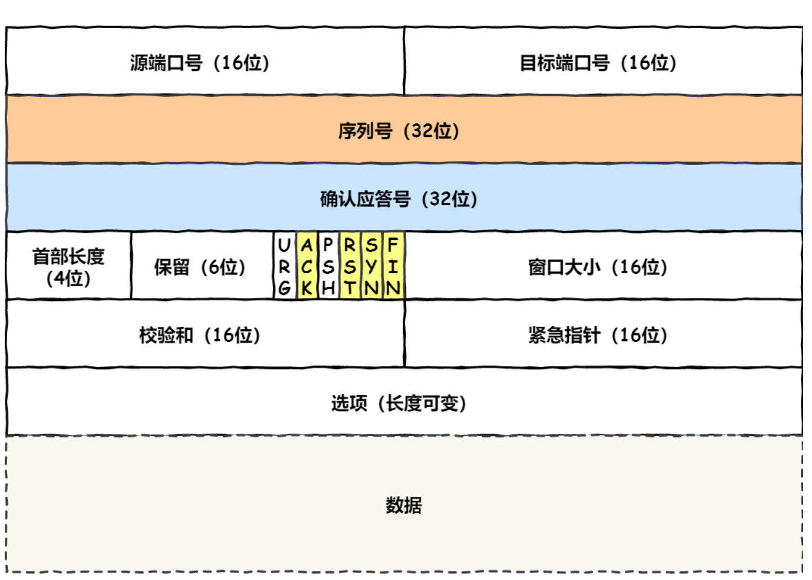
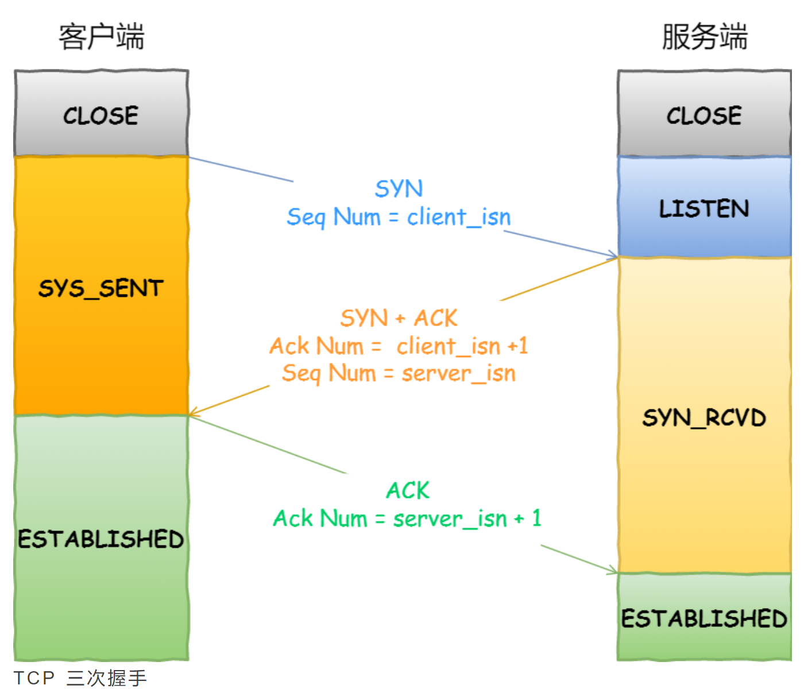
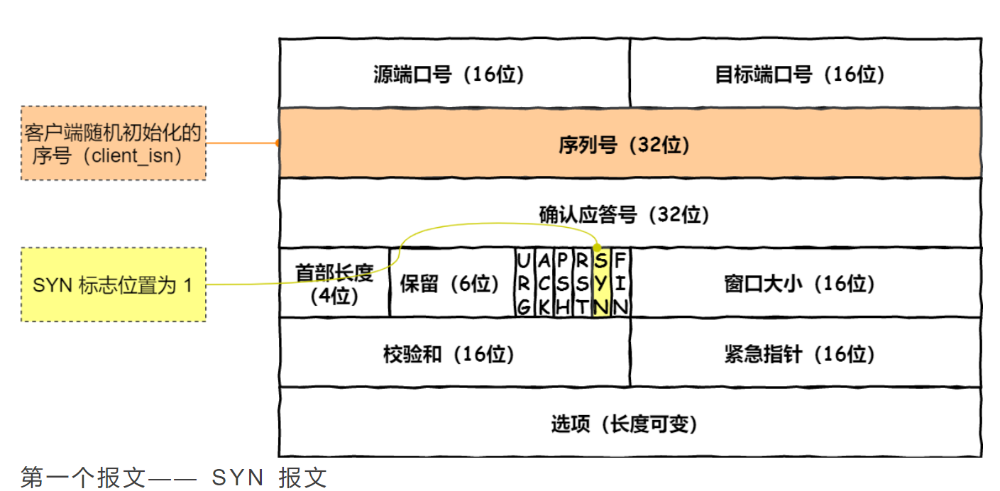
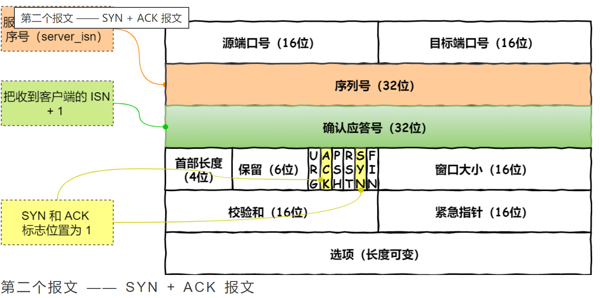
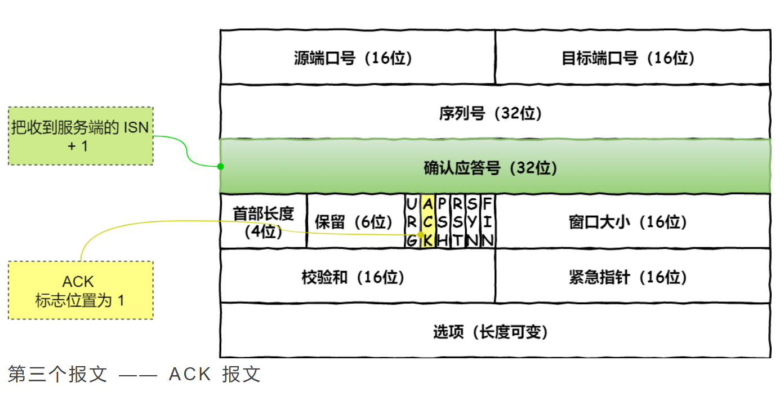
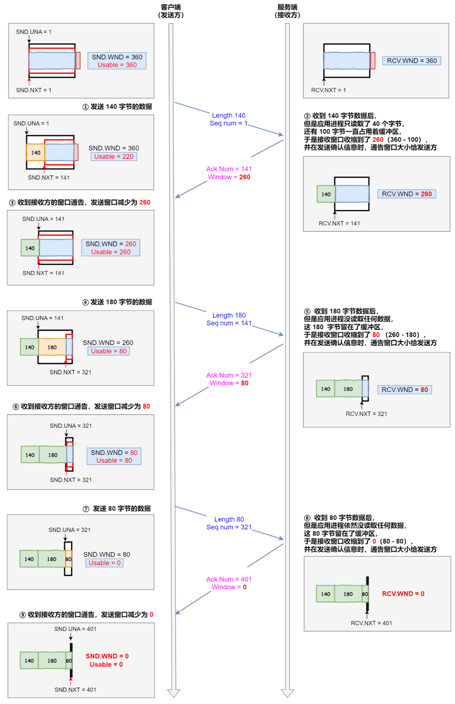
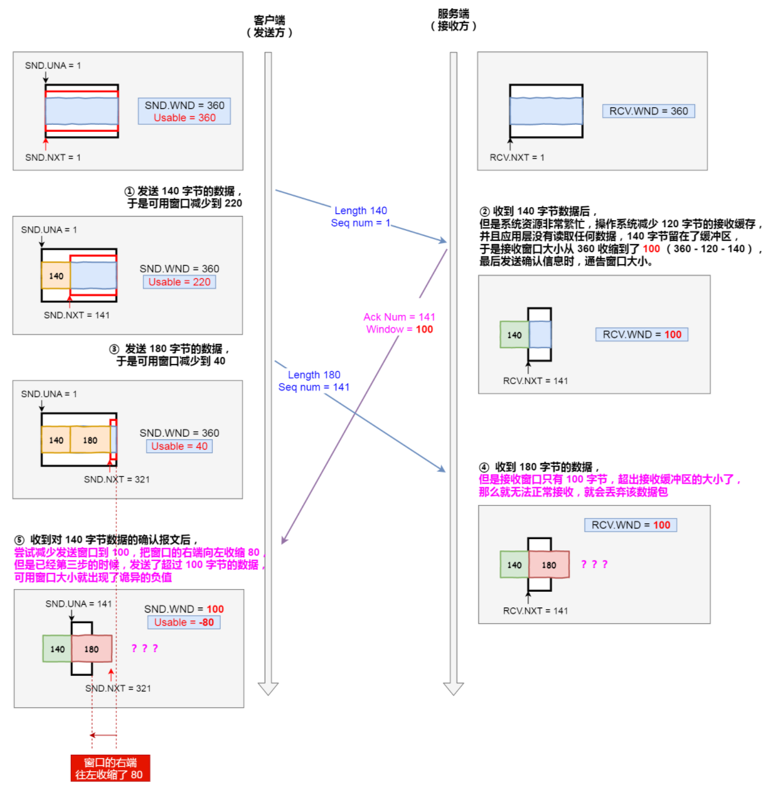

## 网络常见面试问题

## 网络的分层体系结构

- OSI 参考模型
  - 应用层
  - 表示层
  - 会话层
  - 传输层
  - 网络层
  - 数据链路层
  - 物理层
- TCP/IP分层模型
  - 应用层（对应应用层+表示层+会话层）（HTTP/HTTPS/FTP协议）
  - 传输层（TCP/UDP协议）
  - 网络层（IP）
  - 网络接口层（对应数据链路层+物理层）

## TCP详解

### TCP基本认识

#### TCP头部格式

- 源端口号（16位）目标端口号（16位）
- 序列号（32位）
  - 建立连接时由计算机生成的随机数作为初始值，通过SYN包传给接收端。每发送一次数据，就【累加】一次【该数据字节数】大小。用来解决网络包乱序问题。
- 确认应答号（32位）
  - 指下一次期望接收到的数据序列号，发送端收到这个确认应答之后可以认为在这个序号以前的数据都已经被正常接收
  - **用来解决丢包问题。**
- 首部长度（4位）保留（6位），标志位 URG/**ACK**/PHS/**RST**/**SYN**/**FIN**（6位），窗口大小（16位）
  - ACK ：该位为1时，确认应答字段有效，TCP规定除了最初建立发送的SYN包以外，其他时候该位必须置1。
  - RST：该位置1时，表示TCP连接出现异常必须强制断开连接。
  - SYN：该位置1时，表示希望建立连接，并在其序列号字段初始化序列号。
  - FIN：该位置1时，表示今后不会再有数据发送，希望断开连接。当通信结束希望断开连接时，通信双方的主机就可以互相交换FIN位为1的TCP段。
- 校验和（16位）紧急指针（16位）
- 选项（可变长度）
- 数据

#### 什么是TCP

TCP 是**面向连接的、可靠的、基于字节流**的传输层通信协议。

- 面向连接：一定是【一对一】，不能像UDP可以一个主机同时对多个主机发送信息。
- 可靠的：无论网络链路中出现了怎样的变化，TCP都可以保证一个报文一定可以到达接收端；
- 字节流：消息是【无边界】的。并且消息是【有序】的。当前一个消息没有收到时，即使收到了后一个消息，也不能交给应用层去处理。同时对于【重复】的报文会自动丢弃。

#### 什么是TCP连接

首先，什么是连接：

- 用于保证**可靠性**和**流量控制**而维护的某些状态信息，这些信息的组合，包括**Socket、序列号和窗口大小**称为连接。

因此一个TCP连接需要客户端和服务端达成上述三个信息的共识

- Socket：由IP地址和端口号组成
- 序列号：解决乱序问题
- 窗口大小：做流量控制

#### 如果唯一确定一个TCP连接

TCP四元组可以唯一确定一个连接，四元组包括如下：

- 源地址（IP头部）
- 源端口（TCP头部）
- 目的地址（IP头部）
- 目的端口（TCP头部）

#### UDP和TCP有什么区别/分别的应用场景

UDP不提供复杂的控制机制，利用IP提供面向【无连接】的通信服务。

UDP的头部

- 源端口号（16位）目标端口号（16位）
- 包长度（16位）校验和（16位）
- 数据

**TCP和UDP区别**

1. 连接

- TCP时面向连接的传输层协议，传输数据前要先建立协议
- UDP不需要，即刻传输数据

2. 服务对象

- TCP是一对一的两点服务
- UDP支持一对一、一对多、多对多的交互通信

3. 可靠性

- TCP是可靠交付数据的，数据可以无差错、不丢失、不重复、按需到达。
- UDP是尽最大努力交付，不保证可靠较复数据。

4. 拥塞控制、流量控制

- TCP有拥塞控制机制
- UDP没有

5. 首部开销

- TCP首部长度较长，会有一定开销，首部在没有使用选项字段时是20字节。
- UDP首部仅有8字节。

6. 传输方式

- TCP是流式传输，无边界
- UDP是一个一个包发送，有边界，但可能会丢包和乱序。

7. 分片不同

- TCP的数据大小如果大于MSS大小，则会在传输层进行分片，目标主机同样也会在传输层组装TCP数据包，如果中途丢失了一个分片，只需要传输丢失的这个分片。
- UDP的数据大小如果大于MTU大小，则会在IP层进行分片，目标主机收到后，在IP层组装数据。如果中途丢失一个分片就需要重传所有数据。

## TCP 连接建立

### TCP 三次握手过程和状态变迁

- 一开始，客户端和服务端都处于CLOSED状态。先是服务端主动监听某个端口，处于LISTEN状态

#### 第一个报文：SYN报文

客户端会随机初始化序号(client_isn)，将此序号置于TCP首部的【序号】字段中，同时把SYN标志位置为1，表示SYN报文。接着把第一个SYN报文发送给客户端，表示向服务端发起连接，该报文不包含应用层数据，之后客户端处于SYN-SENT状态。

#### 第二个报文：SYN+ACK报文

服务端收到客户端的SYN报文之后，首先服务端也随机初始化自己的序号（server_isn），将此序号填入首部的序列号字段中，其次把TCP首部的确认应答号字段填入client_isn+1，接着把SYN和ACK标志位置1。最后把该报文发给客户端，该报文也不包含应用层数据，之后服务端处于SYN-RCVD状态。

#### 第三个报文：ACK报文

客户端收到服务端报文后，还要向服务端回应最后一个应答报文，首先该应答报文TCP首部ACK置1，其次确认应答号字段填入server_isn_1，最后把报文发送给服务端，这次报文可以携带客户到服务器的数据，之后客户端处于ESTABLISHED状态。

服务器收到客户端的应答报文之后，也进入ESTABLISHED状态。

**第三次握手是可以携带数据的，前两次握手是不可以携带数据的。**

## TCP连接断开

### TCP四次挥手

客户端主动关闭连接的情况：

- 客户端打算关闭连接，此时会发送一个TCP首部FIN标志位被置1的报文，也即FIN报文，之后客户端进入FIN_WAIT_1状态。
- 服务端收到该报文后，就向客户端发送ACK应答报文，接着服务端进入CLOSED_WAIT状态。
- 等到服务端处理完数据之后，就会向客户端发送一个TCP首部标志位被置1的报文，之后服务端进入LAST_ACK状态。
- 当客户端收到服务端发送的FIN报文之后，就会返回一个ACK报文给服务端，并进入TIME_WAIT状态。
- 服务器收到ACK报文之后进入CLOSED状态。至此服务端完成连接关闭。

# TCP 控制机制总结

## 重传机制

### 超时重传

- 在发送数据的时候设定一个定时器，如果在指定时间内没有收到对方返回的ACK报文，就会重发该数据，也就是我们常说的超时重传
- 两种情况下触发超时重传
  - 数据包丢失（没到）
  - ACK报文丢失（没回来）
- 超时时间设定（RTO，超时重传时间）
  - 首先需要考虑RTT（消息往返时延）
  - 如果RTO过大的情况下，就会导致客户端对于丢包的反应不及时，导致网络的空隙时间增大，降低网络的传输效率
  - 如果RTO过小的情况下，就会导致客户端对于丢包的过激反应，也就会导致很多不必要的重传，导致网络的复合增大
  - 因此，RTO的值应该略大于RTT的值
- 触发超时之后，TCP会采取超时间隔加倍的策略
  - 每当遇到一次超时重传时，都会将下一次超时时间间隔设为先前值的两倍
  - 两次超时，就说明网络环境差，不宜频繁反复发送

### 快速重传

- 不以时间为驱动，而是以数据为驱动

- 连续发送几份数据，当收到三个相同的报文的时候，就会重传一个丢失的报文段

- 比如

  - 依次发送1，2，3，4，5报文
  - 但是2报文丢掉了，因此服务端没有收到，ACK段不会增加，收到3，4，5的时候返回给客户端的时候依然是序列号为2的报文
  - 当客户端收到三个相同报文的时候，就会触发快速重传机制，重传丢失的报文。

- 这里会出现一个问题，我们重传的时候是

  - 仅重传一个丢失的报文，在上面的例子中就是仅重传2报文

  还是

  - 从丢失的报文往后重传所有的报文，也就是重传2、3、4、5报文
    - 因为客户端并不清楚这三个连续的相同报文是谁传回来的，可能2报文之后也有报文丢失

- 根据TCP的不同实现，以上两种情况都是有可能的
- 为了解决不知道该重传哪些报文，就有了SACK方法

### SACK方法

- Selective Acknowledgement

- 采用这种方法，需要在TCP头部【选项】字段中加一个SACK，它字段可以**将缓存的地图从接收方返回给发送方**
- 当接收方成功接收到一个报文时，将对应序列号的缓存区标记，并返回对应报文
- 如果要支持SACK，必须双方都支持

### D-SACK方法

- Duplicate Selective Acknowledgement
- 可以让发送方知道是发的包丢了还是返回的ACK包丢了

## 滑动窗口

### 窗口概念

- 窗口大小指的就是无需等待确认应答，可以继续发送数据的最大值

- 窗口的实现实际上是在操作系统中开辟的一块缓存空间，发送方主机在等到ACK返回之前必须保留缓存区中对应数据，如果按期收到了确认应答，那么此时数据就可以从缓存区中清除。

- **累计确认/累计应答**：当使用窗口的时候，即使有特定报文没有返回ACK也不会立即重发，而是会通过下一个确认应答来确认是发送的数据丢失还是返回的ACK报文丢失

- 窗口大小由接收方确定。

  - 需要接收方结合自己缓存区情况进行判断。于是发送端就可以根据这个接收端处理能力来发送数据，而不会导致接收端处理不过来。

- 发送方的滑动窗口：

  - 根据发送过程分为四个部分

    1. 已发送且收到ACK的数据（包括通过累计确认确定送达的数据）
    2. 发送窗口：已发送但是未收到ACK确认的数据
    3. 可用窗口：未发送但是总大小在接收方处理范围内的数据（待发送）
    4. 未发送但总大小超过接收方处理范围的数据

  - 如果确认送达之后，滑动窗口会往右边移动，这样又多出了可用窗口

  - 表达发送方滑动窗口的四个部分

    - SND.WND：表示发送窗口的大小（大小由接收方决定）。
    - SND.UNA：一个绝对指针，指向的是已发送但未收到确认的第一个字节的序列号。
    - SND.NXT：也是一个绝对指针，指向未发送但是是在可发送范围的第一个字节的序列号。
    - 我们用SND.UNA + SND.WND来指向未发送且超过接收方处理范围的第一个字节

    可用窗口大小

    - SND.WND - (SND.NXT - SND.UNA)

- 接收方的滑动窗口

  - 接收方的滑动窗口相对简单一些，根据处理的情况划分成三个部分：
    - 已成功接收并确认的数据（等待应用进程读取）
    - 未收到但可以接受的数据
    - 未收到且不可以接受的数据

  - 这三个部分分别用两个指针进行划分：
    - RCV.WND：表示接收窗口的大小，它会通知给发送方
    - RCV.NXT：是一个指针，指向期望从发送方发来的下一个数据字节的序列号，即下一个等待接受的数据
    - 我们采用RCN.NXT + RCV.WND来

- 接收窗口和发送窗口大小并不一定时刻相等

  - 需要考虑传播时延，可能接收窗口扩大的ACK报文还没有达到，这是接收方和发送方窗口自然大小不一样

## 流量控制

如果发送方一直给接收方发送的话，可能会因为超过接收方处理能力导致丢包，进而触发重发机制，导致网络流量浪费

为了解决这一现象，TCP提供了一种可以让【发送方】根据【接收方】的实际接收能力控制发送的数据量，这就是所谓的**流量控制**。

- 假定一切正常的情况下，如何进行

### 考虑操作系统缓冲区对于滑动窗口的影响

之前我们一直假定滑动窗口是不变的，实际上，发送窗口和接收窗口所存放的字节都是放在操作系统内存缓冲区中的，而操作系统缓冲区会被操作系统调整。

当接收方的应用进程没法及时读取缓冲区的内容时，也会对我们的缓冲区造成影响。

对于接收方的影响，我们分成两种情况

#### 接收方没有及时读取缓冲区中的内容

文字分析

- 首先发送方发送一个140字节的数据到接收方
- 接收方收到数据之后
  - 应用进程只读取了40个字节，还有100字节始终占据着缓冲区
  - 于是接收窗口收缩到了260（360 - 100），并在发送确认信息时，更新窗口大小给发送方
- 发送方收到接收方的更新窗口确认报文之后，将发送窗口进行更新。再在更新过的可用窗口之内发送报文。
- 接收方接收到数据之后
  - 应用进程没有读任何数据，接收窗口收缩到了80，于是再次更新
- 收到窗口更新通知，发送合理大小的数据
- 接收方接收到数据之后
  - 应用进程依然没有读取任何数据，于是接收窗口收缩到了0
  - 更新窗口大小给发送方
  - 窗口大小为0一般被称为窗口关闭，需要特殊处理（之后会说）

#### 接收方操作系统直接减少了缓冲区大小

如果操作系统对缓冲区进行了收缩，可能就会导致窗口出现诡异的负大小，这是很难处理的。

因此TCP规定是不允许同时减少缓存又收缩窗口的，而是采用先收缩窗口，过段时间再减少缓存，这样就可以避免了丢包情况。

### 窗口关闭处理

当窗口关闭的时候，如何做处理？

- 让接收方在窗口大小更新的时候对发送方进行通知
  - 需要考虑如果这个ACK报文半路丢掉了？
    - 会陷入接收方等待数据，发送方等待窗口更新的死锁中
- 因此还需要发送方持续发送窗口探针（Window probe）报文
  - 当发送方得知接收方目前窗口关闭之后，会设置一个持续计时器
  - 当计时器超时后，发送方就将发送窗口探针报文
  - 这样就可以避免因为通告窗口报文消失导致的死锁局面
  - 如果三次探针之后窗口大小还是0的话，有的TCP就会选择发送RST报文来中断连接

### 糊涂窗口综合症

如果接收方太忙，导致发送窗口越来越小，那么**每次接收方腾出几个字节并更新窗口的时候，发送方都会义无反顾地发送这几个字节，这就是糊涂窗口综合症。**

然而，我们的TCP头部往往很长（20个字节），为了传输这几个字节的数据，要同时搭上更大的开销，这并不经济。

因此我们通过两方面改善

- 不让接收方通告小窗口
- 不让发送方发送小数据
  - 使用Nagle算法（延时处理）

## 拥塞控制

拥塞控制的目的是为了**避免发送方的数据填满整个网络**

- 为了在发送方调节需要发送的量，定义了一个叫做**拥塞窗口**的概念
  - 拥塞窗口cwnd是发送方维护的一个状态变量，它会根据网络的拥塞程度动态变化。
  - 之前我们说发送窗口和接收窗口是约等于，在引入拥塞窗口之后，就会有所变化。
    - 发送窗口的值 = min(拥塞窗口大小, 接收窗口大小)
  - 拥塞窗口变化的基本规则：
    - 网络拥塞时，拥塞窗口cwnd变小，限制发送
    - 没有拥塞时，拥塞窗口cwnd变大。
- 如何判断网络拥塞？
  - 如果发送方没有在规定时间内接收到ACK应答报文，触发超时重传，就会认为网络出现了拥塞。
- 拥塞控制有哪些控制算法？
  - 慢启动
  - 拥塞避免
  - 拥塞发生
  - 快速恢复

### 慢启动

- 规则：当发送方每收到一个ACK，拥塞窗口cwnd的大小就会加1。

- 假设一开始时cwnd为1，且暂且不考虑接收窗口，即假设发送窗口和拥塞窗口大小一致

  - 那么当第一轮发送收到ACK之后，下一次cwnd就会变为2
  - 当第二轮发送收到ACK之后，下一轮cwnd就会变成4
  - ...

  可见在慢启动算法下，cwnd是指数增长的

  但存在慢启动门限ssthresh变量，

  - 当cwnd < ssthresh时，使用慢启动
  - 当cwnd >= ssthresh时，使用**拥塞避免算法**

### 拥塞避免算法

- 规则：当发送方每收到一个ACK，拥塞窗口cwnd的大小增加(1/cwnd)
- 简单来说，就是从指数增长变成了线性增长
- 但拥塞避免算法依然是增长，同样会最终导致网络拥塞，出现丢包现象，触发重传。
- 当触发重传之后，就会进入**拥塞发生算法**

### 拥塞发生算法

- 根据上文，触发的重传可能有两种

  - 超时重传
  - 快速重传

  这两种重传机制所使用的拥塞发生算法是不同的。

- 超时重传的拥塞发生算法

  当超时重传被触发时

  - ssthresh被设置为cwnd/2
  - cwnd重置为1
  - 重新开始慢启动

  这种方式相对激进，会造成网络卡顿

- 快速重传对应的拥塞发生算法

  当快速重传被触发时

  - cwnd = cwnd / 2，设置为原来的一半

  - ssthresh  = cwnd

  - 进入快速恢复算法

    问题来了，什么是**快速恢复算法**？

### 快速恢复

在快速重传的情况下，我们往往会在丢掉一个报文的情况下依然接收到几个之后的报文，快速恢复会认为，既然你能接受到这几个报文，说明网络也没有那么糟糕。所以没有必要那么激进。

在进入快速恢复之前，cwnd和ssthresh已经被更新了

之后进入快速恢复算法如下：

- 拥塞窗口cwnd = ssthresh + {快速重传时可以接收到的报文数量}
- 重传丢失的数据包
- 如果依然收到重复的ACK（重传失败），那么cwnd增加1
- 如果收到新的ACK，那么把cwnd设置为第一步中的ssthresh值，原因是ACK更新证明之前的数据都已经正常接收，那么恢复过程已经可以结束了，即再次进入拥塞避免状态。

1. 网络的几种分层体系结构
2. 建立TCP服务器的各个系统调用
3. socket网络编程有哪些系统调用？其中close是一次就能直接关闭的吗，半关闭状态是怎么产生的？
4. MTU和MSS
5. 对路由协议的了解与介绍

> 内部网关协议(IGP)包括RIP，OSPF，和外部网关协议EGP和BGP.

6. 路由协议所使用的算法
7. 路由表的项目包括哪些
8. 地址解析协议ARP的过程
9. 网际控制报文协议ICMP的过程
10. 动态主机配置协议DHCP的过程
11. WAN  LAN  WLAN   VLAN  VPN的区别
12. 介绍一下VPN（虚拟专用网）
13. TCP和UDP的区别
14. [TCP如何保证数据的正确性](https://blog.csdn.net/bjrxyz/article/details/75194716)
15. TCP和UDP相关的协议与端口号
16. TCP（UDP，IP）等首部的认识（http请求报文构成）
17. 网络层分片的原因与具体实现
18. TCP的三次握手与四次挥手的详细介绍（TCP连接建立与断开是热门问题）
19. TCP握手以及每一次握手客户端和服务器端处于哪个状态（11种状态）
20. 为什么使用三次握手，两次握手可不可以？
21. TIME_WAIT的意义（为什么要等于2MSL）
22. 超时重传机制（不太高频）
23. TCP怎么保证可靠性（面向字节流，超时重传，应答机制，滑动窗口，拥塞控制，校验等）？
24. 流量控制的介绍，采用滑动窗口会有什么问题（死锁可能，糊涂窗口综合征）？
25. TCP滑动窗口协议
26. 拥塞控制和流量控制的区别
27. TCP拥塞控制，算法名字？（极其重要）
28. 网页解析的过程与实现方法
29. 应用层协议常用的端口号
30. http协议与TCP联系
31. http/1.0和http/1.1的区别
32. http的请求方法有哪些？get和post的区别。
33. http的状态码
34. http和https的区别，由http升级为https需要做哪些操作
35. https的具体实现，怎么确保安全性
36. 在浏览器输入一个URL的流程，这个过程中浏览器做了什么（如www.baidu.com）
37. URL包括哪三个部分？
38. [长连接与短连接的区别以及使用场景](https://blog.csdn.net/zou2ouzou/article/details/76570171)

39. 一个机器能够使用的端口号上限是多少，为什么？可以改变吗？那如果想要用的端口超过这个限制怎么办？
40. 介绍一下ping的过程，分别用到了哪些协议
41. 对称密码和非对称密码体系
42. 数字证书的了解（高频）
43. 客户端为什么信任第三方证书
44. RSA加密算法（非对称加密，用公匙和私匙实现）;
45. MD5原理（MD5是密码散列函数）=> SHA安全散列算法替代
46. 单条记录高并发访问的优化

47. [数据流和粘包问题](https://blog.csdn.net/bjrxyz/article/details/73351248) 
48. 一台机器最多可以建立多少tcp连接？
49. 五种IO模型的过程和比较

> 阻塞IO、非阻塞IO、IO多路复用、信号驱动IO、异步IO

50. IO多路复用（select，poll，epoll的区别）
51. 有没有抓过TCP包，描述一下
52. 一个ip配置多个域名，靠什么识别？
53. 服务器攻击（DDos攻击）
54. 重放攻击，IP欺骗